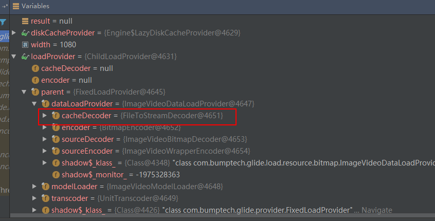
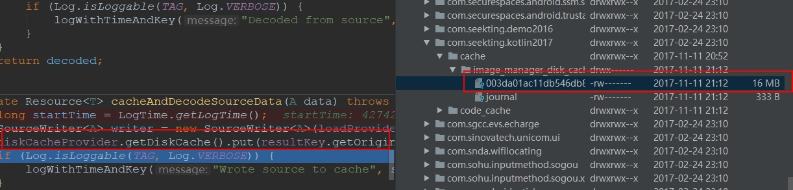

# Glide 显示视频缩略图及遇到的坑


## 实现原理
Glide支持视频格式的文件，但是在3.x里会有些欠缺。其底层是通过 MediaMetadataRetriever实现的。

MediaMetadataRetriever拥有获取视频的第几帧的能力,Glide获取视频里的第n帧的代码如下:

VideoBitmapDecoder.java
```java
@Override
public Bitmap decode(ParcelFileDescriptor resource, BitmapPool bitmapPool, int outWidth, int outHeight,
        DecodeFormat decodeFormat)
        throws IOException {
    MediaMetadataRetriever mediaMetadataRetriever = factory.build();
    mediaMetadataRetriever.setDataSource(resource.getFileDescriptor());
    Bitmap result;
    if (frame >= 0) {
      result = mediaMetadataRetriever.getFrameAtTime(frame);
    } else {
      result = mediaMetadataRetriever.getFrameAtTime();
    }
    mediaMetadataRetriever.release();
    resource.close();
    return result;
}

```

### 提取核心代码
mediaMetadataRetriever获取Bitmap的代码：
```java
val file = FileInputStream(File(path))
val s = MediaMetadataRetriever()
s.setDataSource(file.fd)
file.close()
val bitmap = s.getFrameAtTime(-1)
imageView.setImageBitmap(bitmap)
s.release()

```

## Glide3.x的一个bug
但3.x的Glide缓存策略不能是Source我们来分析各种缓存策略Glide的内部的逻辑

### Result缓存策略

EngineRunnable.java
```java
private Resource<?> decode() throws Exception {
    if (isDecodingFromCache()) {
        return decodeFromCache();
    } else {
        return decodeFromSource();
    }
}

```

EngineRunnable分走两次，第一次走isDecodingFromCache


```java
private Resource<?> decodeFromCache() throws Exception {
    Resource<?> result = null;
    //...ignore code
    
    //先从result缓存里获取
        result = decodeJob.decodeResultFromCache();
    if (result == null) {
    //再从源文件缓存里获取
        result = decodeJob.decodeSourceFromCache();
    }
    return result;
}

```
第一次加载显示decodeResultFromCache会为空，我们略过,重点看decodeSourceFromCache


```java
public Resource<Z> decodeSourceFromCache() throws Exception {
    //如果不是cacheSource直接返回空
    if (!diskCacheStrategy.cacheSource()) {
        return null;
    }

  //...ignore code
}

```

decode失败以后会把EngineRunnable 扔给另外一个线程

```java
  private void onLoadFailed(Exception e) {
        if (isDecodingFromCache()) {
            stage = Stage.SOURCE;
            manager.submitForSource(this);
        } else {
            manager.onException(e);
        }
    }

```

因此它会再一次走到run()方法里的decode，而此次走的是decodeFromSource

DecodeJob.java
```java
 public Resource<Z> decodeFromSource() throws Exception {
        Resource<T> decoded = decodeSource();
        return transformEncodeAndTranscode(decoded);
    }

```

```java
    private Resource<T> decodeSource() throws Exception {
        Resource<T> decoded = null;
        try {
           // 通过fetcher去加载Source
            final A data = fetcher.loadData(priority);
          //...ignore code
            decoded = decodeFromSourceData(data);
        } finally {
            fetcher.cleanup();
        }
        return decoded;
    }


```


DecodeJob.java
```java
private Resource<T> decodeFromSourceData(A data)  {
    final Resource<T> decoded;
    if (diskCacheStrategy.cacheSource()) {
        decoded = cacheAndDecodeSourceData(data);
    } else {
        //因为缓存策略是Result，所以走的是该处
        decoded = loadProvider.getSourceDecoder().decode(data, width, height);
        //...ignore code
    }
    return decoded;
}

```
SourceDecode其实就是ImageVideoBitmapDecoder
```java
public Resource<Bitmap> decode(ImageVideoWrapper source
                            , int width, int height){
    Resource<Bitmap> result = null;
    InputStream is = source.getStream();
    if (is != null) {
            //通过streamDecoder去decode图，它是StreamBitmapDecoder
            result = streamDecoder.decode(is, width, height);
    }

    if (result == null) {
        ParcelFileDescriptor fileDescriptor = source.getFileDescriptor();
        if (fileDescriptor != null) {
             //通过fileDescriptorDecoder去decode图，它是FileDescriptorBitmapDecoder
            result = fileDescriptorDecoder.decode(fileDescriptor, width, height);
        }
    }
    return result;
}

```
ImageVideoBitmapDecoder里有两种decoder

1. StreamBitmapDecoder直接将输入流转成Bitmap
1. FileDescriptorBitmapDecoder能将流通过VideoBitmapDecoder去转Bitmap

而VideoBitmapDecoder底层就是通过MediaMetadataRetriever去获取第一帧

如果源文件是视频，它将先通过StreamBitmapDecoder去decode，结果decode失败result=null<br>
然后通过FileDescriptorBitmapDecoder去decode，可见这里Glide内部并不知道源文件是图片还是视频，所以先用图片的方式解<br>
而图片方式解的时候也是去读它的头文件:

```java
@Override
public Resource<Bitmap> decode(InputStream source, int width, int height) {
  //通过downsampler去decode
    Bitmap bitmap = downsampler.decode(source, bitmapPool, width, height, decodeFormat);
    return BitmapResource.obtain(bitmap, bitmapPool);
}

```
```java
@Override
public Bitmap decode(InputStream is, BitmapPool pool, int outWidth,
        int outHeight, DecodeFormat decodeFormat) {
    final ByteArrayPool byteArrayPool = ByteArrayPool.get();
    final byte[] bytesForOptions = byteArrayPool.getBytes();
    final byte[] bytesForStream = byteArrayPool.getBytes();
    //此处用了Option池，值得学习!
    final BitmapFactory.Options options = getDefaultOptions();
    //...ignore code
    
       final Bitmap downsampled =
       downsampleWithSize(invalidatingStream, bufferedStream, 
       options, pool, inWidth, inHeight, sampleSize,
                                decodeFormat);
    

```

```java
 private static Bitmap decodeStream(MarkEnforcingInputStream is, RecyclableBufferedInputStream bufferedStream,
            BitmapFactory.Options options) {
         if (options.inJustDecodeBounds) {
             is.mark(MARK_POSITION);
         } else {
             bufferedStream.fixMarkLimit();
         }
         //如果是视频文件此处无法decode出Bitmap
        final Bitmap result = BitmapFactory.decodeStream(is, null, options);
        //...ignore code

        return result;
    }

```
第一种decode失败会用第二种，也就是最终会走到VideoBitmapDecoder去解析

### Source缓存策略
如果缓存策略是Source

```java
private Resource<T> decodeSource() throws Exception {
    Resource<T> decoded = null;
    try {
        final A data = fetcher.loadData(priority);
        //...ignore code
        decoded = decodeFromSourceData(data);
    } finally {
        fetcher.cleanup();
    }
    return decoded;
}

```
```java
private Resource<T> decodeFromSourceData(A data)  {
    final Resource<T> decoded;
    //因为是缓存Source因为走cacheAndDecodeSourceData方法
    if (diskCacheStrategy.cacheSource()) {
        decoded = cacheAndDecodeSourceData(data);
    } else {
        long startTime = LogTime.getLogTime();
        decoded = loadProvider.getSourceDecoder().decode(data, width, height);
        if (Log.isLoggable(TAG, Log.VERBOSE)) {
            logWithTimeAndKey("Decoded from source", startTime);
        }
    }
    return decoded;
}

```

```java
private Resource<T> cacheAndDecodeSourceData(A data) {
    SourceWriter<A> writer = new SourceWriter<A>(loadProvider.getSourceEncoder(), data);
    //通过DisckCache把源文件缓存
    diskCacheProvider.getDiskCache().put(resultKey.getOriginalKey(), writer);
    //然后通过loadFromCache去加载缓存
    Resource<T> result = loadFromCache(resultKey.getOriginalKey());
    return result;
}

```

而加载缓存的Decoder是CacheDecoder,非常不幸它不是ImageVideoBitmapDecoder
```java

private Resource<T> loadFromCache(Key key)  {
    File cacheFile = diskCacheProvider.getDiskCache().get(key);
    if (cacheFile == null) {
        return null;
    }

    Resource<T> result = null;
    try {
        result = loadProvider.getCacheDecoder().decode(cacheFile, width, height);
    } finally {
        if (result == null) {
            diskCacheProvider.getDiskCache().delete(key);
        }
    }
    return result;
}

```
它是FileToStreamDecoder,以下是截图
 

而FileToStreamDecoder的Decoder是StreamBitmapDecoder，最终它是把该文件当成图片解析
因此导致它失败，如果result==null,它还会走
```java
diskCacheProvider.getDiskCache().delete(key);

```
所以如果是视频流，缓存策略是Source，它会很让你失望，不停的copy文件，再解，解失败再删除，一直这样下去

如果该源文件很大，会影响Glide的性能！

为了验证这一猜想,我们可以通过抓包工具看一下发生了什么:

 

结果它确实把这个视频存下来了，不过发现decode失败就会把它删除

所以，显示视频图的时候，一定切记不要用Source缓存策略，它不仅无法加载成功，而且会给你带来很大隐患

结束!
