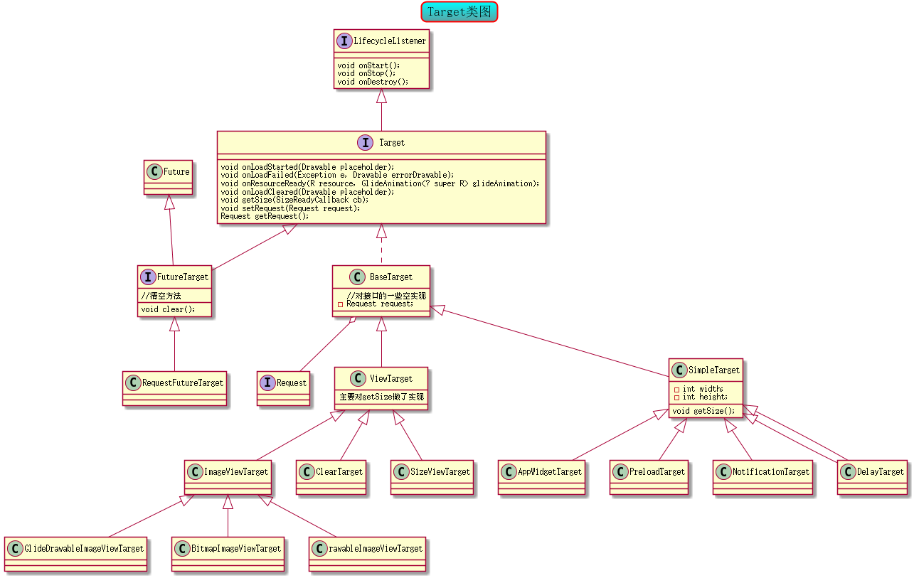

# Glide Target详解

前面我们已经提过一些关于target的内容，并且重点讲了ViewTarget，在这一章，我们再全面性的讲一下它。

以下是它的类图：



## BaseTarget
把request加入进来，并对一些接口的方法进行空实现
BaseTarget里分ViewTarget和SimpleTarget.

### ViewTarget在前面第五章里讲过。
### SimpleTarget

SimpleTarget多了width和height属性，正因为有height和width，才使得它有资格进真正的请求

requset调beign的时候会调target.getSize()
```java
 @Override
    public void begin() {

        //...ignore code
        if (Util.isValidDimensions(overrideWidth, overrideHeight)) {
            onSizeReady(overrideWidth, overrideHeight);
        } else {
            target.getSize(this);
        }

       //...ignore code
    }

```

而SimpleTarget的getSize非常不一样因为SimpleTarget初始化的时候已经有width和height

所以和ViewTarget有区别，而是直接调用onSizeReady()
```java
 @Override
    public final void getSize(SizeReadyCallback cb) {
        if (!Util.isValidDimensions(width, height)) {
            throw new IllegalArgumentException("");
        }
        cb.onSizeReady(width, height);
    }

```

request的onSizeReady()才会启动Engine去load


## FutureTarget
FutureTarget,多了一个clear方法，来看看官方的建议

```java
FutureTarget<Bitmap> futureTarget = Glide.with(fragment)
                                    .load("http://goo.gl/1asf12")
                                    .asBitmap()
                                    .into(250, 250);
Bitmap myBitmap = futureTarget.get();

//如果bitmap用完之后要调用:
Glide.clear(futureTarget);

```

我们看看Glide.clear()
```java
 public static void clear(FutureTarget<?> target) {
        target.clear();
    }

```
仅仅是调用了target.clear,它的实体类是RequestFutureTarget
RequestFutureTarget 的clear:
```java
  @Override
    public void clear() {
        mainHandler.post(this);
    }


```
run方法里调用了request.clear(),然后调用自己的cancel.
```java
  @Override
    public void run() {
        if (request != null) {
            request.clear();
            cancel(false /*mayInterruptIfRunning*/);
        }
    }

```

requset.clear会调cancel和releaseResource，cancel是为了取消请求，releaseResource是把当前的bitmap放进内在缓存
```java
  public void clear() {
        Util.assertMainThread();
        if (status == Status.CLEARED) {
            return;
        }
        cancel();
        // Resource must be released before canNotifyStatusChanged is called.
        if (resource != null) {
            releaseResource(resource);
        }
        if (canNotifyStatusChanged()) {
            target.onLoadCleared(getPlaceholderDrawable());
        }
        // Must be after cancel().
        status = Status.CLEARED;
    }

```

总的来说FutureTarget有一个脱离view的能力，当用户不想用的时候记得释放它就可以了。
另外FutureTask还有Future的能力这是java　concurrent的知识，不过多的讲解。

总结一下:target的最重要的就是width和height,当然
```java
int SIZE_ORIGINAL = Integer.MIN_VALUE;

   public SimpleTarget() {
        this(SIZE_ORIGINAL, SIZE_ORIGINAL);
    }
```
如果宽高没定义也不要紧，SimpleTarget的默认宽高就是MIN_VALUE，

系统得知是SIZE_ORIGINAL 就会按源图的宽高处理.

```java
 @Override
    public final Resource<Bitmap> transform(Resource<Bitmap> resource, int outWidth, int outHeight) {
        //...ignore code
        Bitmap toTransform = resource.get();
        int targetWidth = outWidth == Target.SIZE_ORIGINAL ? toTransform.getWidth() : outWidth;
        int targetHeight = outHeight == Target.SIZE_ORIGINAL ? toTransform.getHeight() : outHeight;
        Bitmap transformed = transform(bitmapPool, toTransform, targetWidth, targetHeight);

        final Resource<Bitmap> result;
        if (toTransform.equals(transformed)) {
            result = resource;
        } else {
            result = BitmapResource.obtain(transformed, bitmapPool);
        }

        return result;
    }

```


