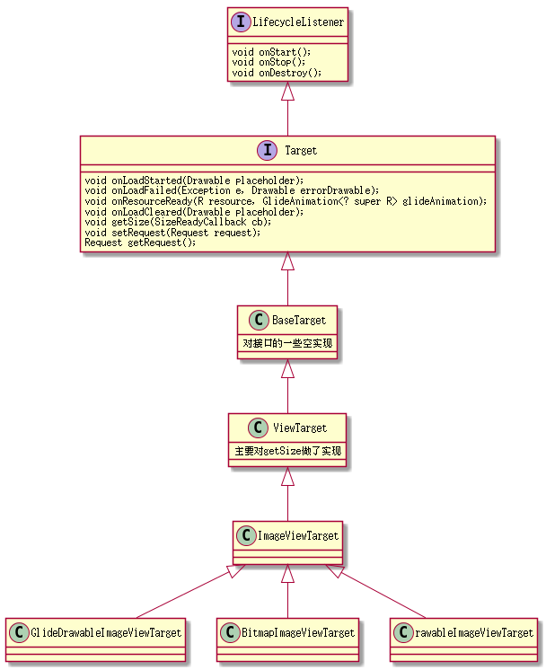

# Glide Disk缓存策略


* [1.语法示例](#1)

    * [1.1图片](#1.1)

    * [1.2换行](#1.2)

    * [1.3强调](#1.3)
## 前言
Glide的Sd卡缓存会比其它框架的高明一些，它不仅仅会缓存原图，还会保存指定大小的图名为Result图<br>
假如你的ImageView大小是200x200px，而网络图片是400x400，第一次从网络加载时，它能把400*400的原图缓存本地,<br>
同时因为该图要放在200x200里会明显没必要，系统会decode成200x200的图给ImageView展示<br>
并且它还能把这张200x200的图缓存在本地，下次碰到一个200x200的View直接从本地读。

## 源码分析
### 四种缓存策略
Glide的Disk缓存机制有四种通过两个开关的排列组合

1. ALL代表结果图和原图都存
1. NONE表示都不存
1. SOURCE表示只存原图
1. RESULT表示只存结果图

```java
public enum DiskCacheStrategy {
    ALL(true, true),
    NONE(false, false),
    SOURCE(true, false),
    RESULT(false, true);
    private final boolean cacheSource;
    private final boolean cacheResult;
    DiskCacheStrategy(boolean cacheSource, boolean cacheResult) {
        this.cacheSource = cacheSource;
        this.cacheResult = cacheResult;
    }

    public boolean cacheSource() {
        return cacheSource;
    }

    public boolean cacheResult() {
        return cacheResult;
    }
}

```
### 默认缓存策略
Glide系统默认用的是Result策略:
```java
public class GenericRequestBuilder.. implements Cloneable {
 private DiskCacheStrategy diskCacheStrategy = DiskCacheStrategy.RESULT;
}

```
通过源码可以看出默认是缓存的是结果图
> 这也就能解释为什么两个不同的View去加载同一个url，它会请求两次

### 自定义缓存策略

#### 通过RequestBuilder

通过RequestBuilder意味着你每次发请求都可以自定义它的缓存策略
```java
 Glide.with(this).load(url).diskCacheStrategy(DiskCacheStrategy.SOURCE).into(imageview)

```
以下是builder模式传入diskCacheStrategy
```java
public GenericRequestBuilder<..>  diskCacheStrategy(
        DiskCacheStrategy strategy) {
    this.diskCacheStrategy = strategy;

    return this;
}
最终会创建一个自定义diskCacheStrategy的Request，这里就不贴出源码


```
#### 通过RequestManagerOptions
RequestManagerOptions方式是基于RequestManager对象实现的，它有两个成员optionsApplier和options

```java
public class RequestManager implements LifecycleListener {
    private final Context context;
    private final Lifecycle lifecycle;
    private final RequestManagerTreeNode treeNode;
    private final RequestTracker requestTracker;
    private final Glide glide;
    private final OptionsApplier optionsApplier;
    private DefaultOptions options;

```
而optionsApplier则会在构造里new一个，它的作用其实是代理
```java
 RequestManager(Context context, final Lifecycle lifecycle, RequestManagerTreeNode treeNode,
                   RequestTracker requestTracker, ConnectivityMonitorFactory factory) {
        this.context = context.getApplicationContext();
        this.lifecycle = lifecycle;
        this.treeNode = treeNode;
        this.requestTracker = requestTracker;
        this.glide = Glide.get(context);
        this.optionsApplier = new OptionsApplier();

```
OptionsApplier是RequestManager的内部类，当调用apply的时候，调用options的apply，当然如果用户没有传apply，就会什么也不会发生。
> 这样设计的好处是：系统内部不用每次在调用apply的地方去判空，而是统一在代理类内部去判断空，值得学习！
```java

class OptionsApplier {

    public <A, X extends GenericRequestBuilder<A, ?, ?, ?>> X apply(X builder) {
        if (options != null) {
            options.apply(builder);
        }
        return builder;
    }
}

```
当你自定义了option以后，你就想怎么自定义builder就怎么自定义builder
```java
    class MyOption implements RequestManager.DefaultOptions{
        @Override
        public <T> void apply(GenericRequestBuilder<T, ?, ?, ?> requestBuilder) {
            requestBuilder.diskCacheStrategy(DiskCacheStrategy.ALL);
        }
    }

```
只要是同一个RequestManager，它都会给Builder最后一次更改属性的机会
```java
Glide.with(this).setDefaultOptions(new MyOption());

```
以后的RequestManager都会得出同一种Builder

以下是optionsApplier.apply的实现细节

```java
private <T> DrawableTypeRequest<T> loadGeneric(Class<T> modelClass) {
            Glide.buildFileDescriptorModelLoader(modelClass, context);
            //...ignore code

    return optionsApplier.apply(
    new DrawableTypeRequest<T>(modelClass, streamModelLoader, fileDescriptorModelLoader, context,
            glide, requestTracker, lifecycle, optionsApplier));
}

```
> 通过apply来得出有一类特性的Builder是一个不错的方式，值的学习。
无独有偶，Glide对象的Builder也有apply的方式去定制Builder得出定制Glide对象

## 跟踪diskCacheStrategy的底层处理

diskCacheStrategy首先被放入Builder当中，后面经历了多少逻辑，最终实现它的意图呢？我们一步一步分析。

### Request中的diskCacheStrategy

```java

public final class GenericRequest<A, T, Z, R> implements //...ignore code{
        //...ignore code
    private Key signature;
    private Drawable fallbackDrawable;
    private int fallbackResourceId;
    private int placeholderResourceId;
    private int errorResourceId;
    private Context context;
    private Transformation<Z> transformation;
    private LoadProvider<A, T, Z, R> loadProvider;
    private RequestCoordinator requestCoordinator;
    private A model;
    private Class<R> transcodeClass;
    private boolean isMemoryCacheable;
    private Priority priority;
    private Target<R> target;
    private RequestListener<? super A, R> requestListener;
    private float sizeMultiplier;
    private Engine engine;
    private GlideAnimationFactory<R> animationFactory;
    private int overrideWidth;
    private int overrideHeight;
    private DiskCacheStrategy diskCacheStrategy;
```

request在初始化的时候会通过缓存策略来检查相应的decoder及encoder为不为空

```java
 private void init(){
if (diskCacheStrategy.cacheSource()) {
             check("SourceEncoder", loadProvider.getSourceEncoder(),
                     "try .sourceEncoder(Encoder) or .diskCacheStrategy(NONE/RESULT)");
         } else {
             check("SourceDecoder", loadProvider.getSourceDecoder(),
                     "try .decoder/.imageDecoder/.videoDecoder(ResourceDecoder) or .diskCacheStrategy(ALL/SOURCE)");
         }
         if (diskCacheStrategy.cacheSource() || diskCacheStrategy.cacheResult()) {
             // TODO if(resourceClass.isAssignableFrom(InputStream.class) it is possible to wrap sourceDecoder
             // and use it instead of cacheDecoder: new FileToStreamDecoder<Z>(sourceDecoder)
             // in that case this shouldn't throw
             check("CacheDecoder", loadProvider.getCacheDecoder(),
                     "try .cacheDecoder(ResouceDecoder) or .diskCacheStrategy(NONE)");
         }
         if (diskCacheStrategy.cacheResult()) {
             check("Encoder", loadProvider.getEncoder(),
                     "try .encode(ResourceEncoder) or .diskCacheStrategy(NONE/SOURCE)");
         }
}
            
private static void check(String name, Object object, String suggestion) {
    if (object == null) {
        StringBuilder message = new StringBuilder(name);
        message.append(" must not be null");
        if (suggestion != null) {
            message.append(", ");
            message.append(suggestion);
        }
        throw new NullPointerException(message.toString());
    }
}
```

然后通过OnSizeReady去启动引擎，对启动引擎的逻辑不熟悉的可以参考 

 


[Glide into()都做了什么](../glide5/Glide5.md) 

 