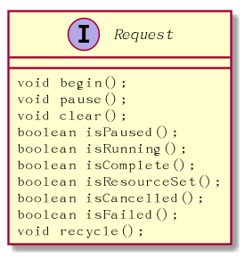

# Glide RequestTracker
官方给的解释： * A class for tracking, canceling, and restarting in progress, completed, and failed requests.
它是跟踪请求过程的一个类，好吧，看了代码我无语了，这哪叫跟踪？明明是控制，它就是控制request的一些行为的类，要我启名就启requsetControler
可以看代码：
```java
 /**
     * Starts tracking the given request.
     */
    public void runRequest(Request request) {
        requests.add(request);
        if (!isPaused) {
            request.begin();
        } else {
            pendingRequests.add(request);
        }
    }


```


```java

    public void pauseRequests() {
        isPaused = true;
        for (Request request : Util.getSnapshot(requests)) {
            if (request.isRunning()) {
                request.pause();
                pendingRequests.add(request);
            }
        }
    }

```

```java

  public void resumeRequests() {
         isPaused = false;
         for (Request request : Util.getSnapshot(requests)) {
             if (!request.isComplete() && !request.isCancelled()
                  && !request.isRunning()) {
                 request.begin();
             }
         }
         pendingRequests.clear();
     }
```
Request是一个接口：

　

fragment把生命周期转给了RequestManager，然后RequestManger会通过RequestTracker去控制Request
> 先不说runRequest从哪调过来的，因为它比较复杂，后面再说

首先看tracker的成员：
```java
private final Set<Request> requests = Collections.newSetFromMap(new WeakHashMap<Request, Boolean>());
private final List<Request> pendingRequests = new ArrayList<Request>();
private boolean isPaused;
  ```

通过requests来记录该Fragment(或是Acitvity)所有的request;<br/>
如果isPaused为true,它会把request装到pendingRequests当中，一旦下次调到resumeRequests的时候会调pendingRequest里的所有request的begin方法<br/>

#### 然后是runRequest
runRequest是被GenericRequestBuilder调用,GenericRequestBuilder有个into方法，经常会有这样的代码:
```java
Glide.with(activity).load("http://xxx.xxx.png").into(imageView);

```
是的，load()的返回就是GenericRequestBuilder的子类，只有调了into才会真的走request.begin :blush:

```java
 public <Y extends Target<TranscodeType>> Y into(Y target) {
        Util.assertMainThread();
        if (target == null) {
            throw new IllegalArgumentException("You must pass in a non null Target");
        }
        if (!isModelSet) {
            throw new IllegalArgumentException("You must first set a model (try #load())");
        }

        Request previous = target.getRequest();

        if (previous != null) {
            previous.clear();
            requestTracker.removeRequest(previous);
            previous.recycle();
        }

        Request request = buildRequest(target);
        target.setRequest(request);
        lifecycle.addListener(target);
        requestTracker.runRequest(request);

        return target;
    }

```
不难看出，如果这个target以前有request,那就把以前的清除，回收，再重新启用新的请求.
想想ListView会多个item去bind同一个View,这个时候view充当target，只要请求新的request,就会把老的request清除，并且target持有request,等数据返回的时候，可以做较验。

还有
```java
public <Y extends Target<TranscodeType>> Y into(Y target)
````
这个方法真是用来装逼用的。
其实这么定义大家就好理解了
```java
public Target<TranscodeType> into(Target<TranscodeType>　target);
```

