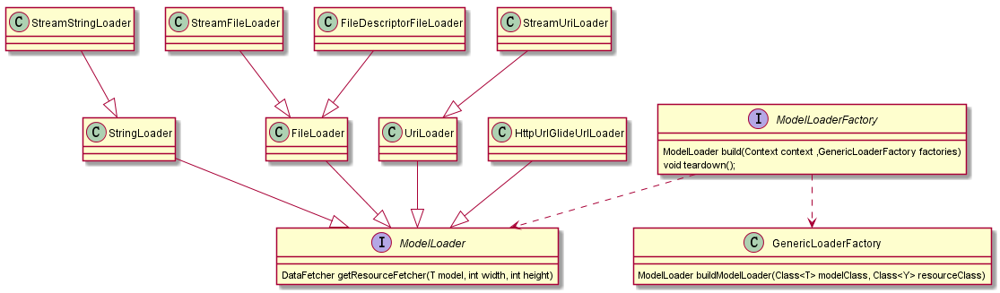

# Glide3
## ModelLoader


Glide 初始化的时候会初始化GenericLoaderFactory,然后会注册一系列的工厂

```java
        register(File.class, ParcelFileDescriptor.class, new FileDescriptorFileLoader.Factory());
        register(File.class, InputStream.class, new StreamFileLoader.Factory());
        register(int.class, ParcelFileDescriptor.class, new FileDescriptorResourceLoader.Factory());
        register(int.class, InputStream.class, new StreamResourceLoader.Factory());
        register(Integer.class, ParcelFileDescriptor.class, new FileDescriptorResourceLoader.Factory());
        register(Integer.class, InputStream.class, new StreamResourceLoader.Factory());
        register(String.class, ParcelFileDescriptor.class, new FileDescriptorStringLoader.Factory());
        register(String.class, InputStream.class, new StreamStringLoader.Factory());
        register(Uri.class, ParcelFileDescriptor.class, new FileDescriptorUriLoader.Factory());
        register(Uri.class, InputStream.class, new StreamUriLoader.Factory());
        register(URL.class, InputStream.class, new StreamUrlLoader.Factory());
        register(GlideUrl.class, InputStream.class, new HttpUrlGlideUrlLoader.Factory());
        register(byte[].class, InputStream.class, new StreamByteArrayLoader.Factory());
```
来看看GenericLoaderFactory.java里的注册

```java
 public synchronized <T, Y> ModelLoaderFactory<T, Y> register(Class<T> modelClass, Class<Y> resourceClass,
            ModelLoaderFactory<T, Y> factory) {
        cachedModelLoaders.clear();

        Map<Class/*Y*/, ModelLoaderFactory/*T, Y*/> resourceToFactories = modelClassToResourceFactories.get(modelClass);
        if (resourceToFactories == null) {
            resourceToFactories = new HashMap<Class/*Y*/, ModelLoaderFactory/*T, Y*/>();
            modelClassToResourceFactories.put(modelClass, resourceToFactories);
        }

        ModelLoaderFactory/*T, Y*/ previous = resourceToFactories.put(resourceClass, factory);

        if (previous != null) {
            // This factory may be being used by another model. We don't want to say it has been removed unless we
            // know it has been removed for all models.
            for (Map<Class/*Y*/, ModelLoaderFactory/*T, Y*/> factories : modelClassToResourceFactories.values()) {
                if (factories.containsValue(previous)) {
                    previous = null;
                    break;
                }
            }
        }

        return previous;
    }
```
它是一个`Map<modelClass,Map<resourceClass,factory>>`结构

然后看看Glide.width(context).load(String)到底干了什么:

```java
  public DrawableTypeRequest<String> load(String string) {
        return (DrawableTypeRequest<String>) fromString().load(string);
    }


    public DrawableTypeRequest<String> fromString() {
          Log.d("seekting","RequestManager.fromString");
          return loadGeneric(String.class);
      }
 private <T> DrawableTypeRequest<T> loadGeneric(Class<T> modelClass) {
        Log.d("seekting","RequestManager.loadGeneric");
        ModelLoader<T, InputStream> streamModelLoader = Glide.buildStreamModelLoader(modelClass, context);
        ModelLoader<T, ParcelFileDescriptor> fileDescriptorModelLoader =
                Glide.buildFileDescriptorModelLoader(modelClass, context);
        if (modelClass != null && streamModelLoader == null && fileDescriptorModelLoader == null) {
            throw new IllegalArgumentException("Unknown type " + modelClass + ". You must provide a Model of a type for"
                    + " which there is a registered ModelLoader, if you are using a custom model, you must first call"
                    + " Glide#register with a ModelLoaderFactory for your custom model class");
        }

        return optionsApplier.apply(
                new DrawableTypeRequest<T>(modelClass, streamModelLoader, fileDescriptorModelLoader, context,
                        glide, requestTracker, lifecycle, optionsApplier));
    }
    
    
     public GenericRequestBuilder<ModelType, DataType, ResourceType, TranscodeType> load(ModelType model) {
            this.model = model;
            isModelSet = true;
            Log.d("seekting","GenericRequestBuilder.load model="+model);
            return this;
        }

```

最复杂就是loadGeneric方法:

它先build两个ModeLoader，分别是 
ModelLoader<String, ParcelFileDescriptor> 
 ModelLoader<String, InputStream>
可以联想一下前面介绍的register

```java
    register(String.class, ParcelFileDescriptor.class, new FileDescriptorStringLoader.Factory());
    register(String.class, InputStream.class, new StreamStringLoader.Factory());

```
是不是有着紧密的联系String.class充当Model,inputStream和ParcelFileDescriptor充当Resource
来看Glide.buildStreamModelLoader做了什么:

```java
  public static <T> ModelLoader<T, InputStream> buildStreamModelLoader(Class<T> modelClass, Context context) {
        return buildModelLoader(modelClass, InputStream.class, context);
    }
    
    
        public static <T, Y> ModelLoader<T, Y> buildModelLoader(Class<T> modelClass, Class<Y> resourceClass,
                Context context) {
             if (modelClass == null) {
                if (Log.isLoggable(TAG, Log.DEBUG)) {
                    Log.d(TAG, "Unable to load null model, setting placeholder only");
                }
                return null;
            }
            return Glide.get(context).getLoaderFactory().buildModelLoader(modelClass, resourceClass);
        }
        

```

最后到GenericLoaderFactory.java
```java
public synchronized <T, Y> ModelLoader<T, Y> buildModelLoader(Class<T> modelClass, Class<Y> resourceClass) {
        ModelLoader<T, Y> result = getCachedLoader(modelClass, resourceClass);
        if (result != null) {
            // We've already tried to create a model loader and can't with the currently registered set of factories,
            // but we can't use null to demonstrate that failure because model loaders that haven't been requested
            // yet will be null in the cache. To avoid this, we use a special signal model loader.
            if (NULL_MODEL_LOADER.equals(result)) {
                return null;
            } else {
                return result;
            }
        }

        final ModelLoaderFactory<T, Y> factory = getFactory(modelClass, resourceClass);
        if (factory != null) {
            result = factory.build(context, this);
            cacheModelLoader(modelClass, resourceClass, result);
        } else {
            // We can't generate a model loader for the given arguments with the currently registered set of factories.
            cacheNullLoader(modelClass, resourceClass);
        }
        return result;
    }
```

先找通过getCachedLoader找缓存要loader，如果没有,则通过之前register的map里去找Factory(getFactory就是二维map里去找,就不细说了);<br/>
会通过factory去build，拿到factory之后会去build，并把它cache住；glide.load(String)最终得到的就是StreamStringLoader
> 为什么注册的时候只是注册factory，而不是Loader自己?

以下是ModelLoader家族类图，没有列全




> 很多Loader都通过UriLoader处理


来看UriLoader的源码:

```java
public abstract class UriLoader<T> implements ModelLoader<Uri, T> {
    private final Context context;
    private final ModelLoader<GlideUrl, T> urlLoader;

    public UriLoader(Context context, ModelLoader<GlideUrl, T> urlLoader) {
        this.context = context;
        this.urlLoader = urlLoader;
    }

    @Override
    public final DataFetcher<T> getResourceFetcher(Uri model, int width, int height) {
        final String scheme = model.getScheme();

        DataFetcher<T> result = null;
        if (isLocalUri(scheme)) {
            if (AssetUriParser.isAssetUri(model)) {
                String path = AssetUriParser.toAssetPath(model);
                result = getAssetPathFetcher(context, path);
            } else {
                result = getLocalUriFetcher(context, model);
            }
        } else if (urlLoader != null && ("http".equals(scheme) || "https".equals(scheme))) {
            result = urlLoader.getResourceFetcher(new GlideUrl(model.toString()), width, height);
        }

        return result;
    }

    protected abstract DataFetcher<T> getLocalUriFetcher(Context context, Uri uri);

    protected abstract DataFetcher<T> getAssetPathFetcher(Context context, String path);

    private static boolean isLocalUri(String scheme) {
        return ContentResolver.SCHEME_FILE.equals(scheme)
                || ContentResolver.SCHEME_CONTENT.equals(scheme)
                || ContentResolver.SCHEME_ANDROID_RESOURCE.equals(scheme);
    }
}

```

它对getResourceFetcher做了实现，通过Uri来决定用哪个Fetcher(获取者)

来看一个有趣的实现

```java
 @Override
    protected InputStream loadResource(Uri uri, ContentResolver contentResolver) throws FileNotFoundException {
        Log.d("seekting", "StreamLocalUriFetcher.loadResource uri=" + uri);
        return contentResolver.openInputStream(uri);
    }
```
本地的res获取方式居然是通过contentResolver,其实看看底层都是通过Resources.openRawResource获取资源 :joy:

总结一下，我们知道了loadGeneric方法里：
`ModelLoader<T, InputStream> streamModelLoader = Glide.buildStreamModelLoader(modelClass, context);`
的逻辑，大概就是拿一个ModelLoader，而这个Loader是通过之前注册了Factory 创建出来的，并有缓存机制在里面

接下来是fileDescriptorModelLoader:
`  ModelLoader<T, ParcelFileDescriptor> fileDescriptorModelLoader =
                 Glide.buildFileDescriptorModelLoader(modelClass, context);`
           
                 
```java
   public static <T> ModelLoader<T, ParcelFileDescriptor> buildFileDescriptorModelLoader(Class<T> modelClass,
            Context context) {
        return buildModelLoader(modelClass, ParcelFileDescriptor.class, context);
    }

```                 
其实逻辑与前面一样，只不过传的resource 是ParcelFileDescriptor

loader得到之后就是new DrawableTypeRequest

```java


 new DrawableTypeRequest<T>(modelClass, streamModelLoader, fileDescriptorModelLoader, context,
                        glide, requestTracker, lifecycle, optionsApplier)

  DrawableTypeRequest(Class<ModelType> modelClass, ModelLoader<ModelType, InputStream> streamModelLoader,
            ModelLoader<ModelType, ParcelFileDescriptor> fileDescriptorModelLoader, Context context, Glide glide,
            RequestTracker requestTracker, Lifecycle lifecycle, RequestManager.OptionsApplier optionsApplier) {
        super(context, modelClass,
                buildProvider(glide, streamModelLoader, fileDescriptorModelLoader, GifBitmapWrapper.class,
                        GlideDrawable.class, null),
                glide, requestTracker, lifecycle);
        this.streamModelLoader = streamModelLoader;
        this.fileDescriptorModelLoader = fileDescriptorModelLoader;
        this.optionsApplier = optionsApplier;
    }

```

而DrawableTypeRequest的构造里：

```java
   super(context, modelClass,
                buildProvider(glide, streamModelLoader, fileDescriptorModelLoader, GifBitmapWrapper.class,
                        GlideDrawable.class, null),

```
来看看这个provider的组成

```java
private static <A, Z, R> FixedLoadProvider<A, ImageVideoWrapper, Z, R> buildProvider(Glide glide,
            ModelLoader<A, InputStream> streamModelLoader,
            ModelLoader<A, ParcelFileDescriptor> fileDescriptorModelLoader, Class<Z> resourceClass,
            Class<R> transcodedClass,
            ResourceTranscoder<Z, R> transcoder)

```
resourceClass是GifBitmapWrapper.class
transcodedClass是GlideDrawable.class
最终生成一个FixedLoadProvider从而创建出DrawableTypeRequest，有关DataLoadProvider下一章会有介绍


