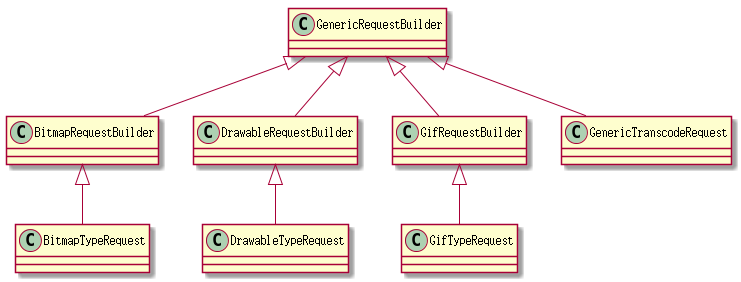
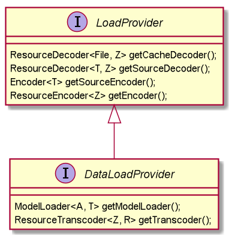

#Glide RequestBuilder
RequestBuilder家族：



### RequestBuilder家族的基类：GenericRequestBuilder.java

 代码有小1000行 :weary:

先来看看类的定义一上来四个泛型
```java
public class GenericRequestBuilder<ModelType, DataType, ResourceType, TranscodeType>
```
private ModelType model;这个就是你请求图片的源，如果是glide.with(context).load(string)那么，modeclass就是string

protected final Class<TranscodeType> transcodeClass; 对应GlideDrawable

protected final RequestTracker requestTracker;控制请求的类
 
DataLoadProvider:一个拥有图片读取和存储实现的提供者，通过它能获取图片存取实现细节的对象:encoder,decoder,cachedecode，而glide初始化的时候就注入了很多的provider

Glide 构造函数：
```java 
dataLoadProviderRegistry.register(InputStream.class, Bitmap.class, streamBitmapLoadProvider);

FileDescriptorBitmapDataLoadProvider fileDescriptorLoadProvider =
 new FileDescriptorBitmapDataLoadProvider(bitmapPool, decodeFormat);
dataLoadProviderRegistry.register(ParcelFileDescriptor.class, Bitmap.class, fileDescriptorLoadProvider);

ImageVideoDataLoadProvider imageVideoDataLoadProvider =
 new ImageVideoDataLoadProvider(streamBitmapLoadProvider, fileDescriptorLoadProvider);
dataLoadProviderRegistry.register(ImageVideoWrapper.class, Bitmap.class, imageVideoDataLoadProvider);

GifDrawableLoadProvider gifDrawableLoadProvider =
 new GifDrawableLoadProvider(context, bitmapPool);
dataLoadProviderRegistry.register(InputStream.class, GifDrawable.class, gifDrawableLoadProvider);

dataLoadProviderRegistry.register(ImageVideoWrapper.class, GifBitmapWrapper.class,
 new ImageVideoGifDrawableLoadProvider(imageVideoDataLoadProvider, gifDrawableLoadProvider, bitmapPool));

dataLoadProviderRegistry.register(InputStream.class, File.class, new StreamFileDataLoadProvider());

```



来赏析一下Glide引擎是怎么decode成bitmap的:

StreamBitmapDataLoadProvider里有个 
decoder = new StreamBitmapDecoder(bitmapPool, decodeFormat);<br/>
cacheDecoder = new FileToStreamDecoder<Bitmap>(decoder);<br/>
 encoder = new BitmapEncoder();<br/>
 
BitmapEncoder.java的encode方法
```java

  @Override
    public boolean encode(Resource<Bitmap> resource, OutputStream os) {
        final Bitmap bitmap = resource.get();

        long start = LogTime.getLogTime();
        Bitmap.CompressFormat format = getFormat(bitmap);
        bitmap.compress(format, quality, os);
        //...ignore code
        return true;
    }
```
encode其实就是compress

而decoder和cacheDecoder 最终都是用一个decoder去解析

StreamBitmapDecoder.java

```java 

 @Override
    public Resource<Bitmap> decode(InputStream source, int width, int height) {
        Bitmap bitmap = downsampler.decode(source, bitmapPool, width, height, decodeFormat);
        return BitmapResource.obtain(bitmap, bitmapPool);
    }


```
Downsampler.java
```java

 @Override
    public Bitmap decode(InputStream is, BitmapPool pool, int outWidth,
                            int outHeight, DecodeFormat decodeFormat) {
        final ByteArrayPool byteArrayPool = ByteArrayPool.get();
        final byte[] bytesForOptions = byteArrayPool.getBytes();
        final byte[] bytesForStream = byteArrayPool.getBytes();
        final BitmapFactory.Options options = getDefaultOptions();

        RecyclableBufferedInputStream bufferedStream = new RecyclableBufferedInputStream(
                is, bytesForStream);
        ExceptionCatchingInputStream exceptionStream =
                ExceptionCatchingInputStream.obtain(bufferedStream);
        MarkEnforcingInputStream invalidatingStream = new MarkEnforcingInputStream(exceptionStream);
        try {
            exceptionStream.mark(MARK_POSITION);
            int orientation = 0;
            try {
                orientation = new ImageHeaderParser(exceptionStream).getOrientation();
            } catch (IOException e) {
                if (Log.isLoggable(TAG, Log.WARN)) {
                    Log.w(TAG, "Cannot determine the image orientation from header", e);
                }
            } finally {
                try {
                    exceptionStream.reset();
                } catch (IOException e) {
                    if (Log.isLoggable(TAG, Log.WARN)) {
                        Log.w(TAG, "Cannot reset the input stream", e);
                    }
                }
            }

            options.inTempStorage = bytesForOptions;

            final int[] inDimens = getDimensions(invalidatingStream, bufferedStream, options);
            final int inWidth = inDimens[0];
            final int inHeight = inDimens[1];

            final int degreesToRotate = TransformationUtils.getExifOrientationDegrees(orientation);
            final int sampleSize = getRoundedSampleSize(degreesToRotate,
                                    inWidth, inHeight, outWidth, outHeight);

            final Bitmap downsampled =
                    downsampleWithSize(invalidatingStream, bufferedStream, options, pool, inWidth,
                    inHeight, sampleSize,decodeFormat);

            final Exception streamException = exceptionStream.getException();
            if (streamException != null) {
                throw new RuntimeException(streamException);
            }

            Bitmap rotated = null;
            if (downsampled != null) {
                rotated = TransformationUtils.rotateImageExif(downsampled, pool, orientation);

                if (!downsampled.equals(rotated) && !pool.put(downsampled)) {
                    downsampled.recycle();
                }
            }

            return rotated;
        } finally {
            byteArrayPool.releaseBytes(bytesForOptions);
            byteArrayPool.releaseBytes(bytesForStream);
            exceptionStream.release();
            releaseOptions(options);
        }
    }
```


```java
   private static Bitmap decodeStream(MarkEnforcingInputStream is,
                                        RecyclableBufferedInputStream bufferedStream,
            BitmapFactory.Options options) {
         if (options.inJustDecodeBounds) {
             is.mark(MARK_POSITION);
         } else {
             bufferedStream.fixMarkLimit();
         }

        final Bitmap result = BitmapFactory.decodeStream(is, null, options);

        try {
            if (options.inJustDecodeBounds) {
                is.reset();
            }
        } catch (IOException e) {
            //...ignore code
        }

        return result;
    }


```
说白了最终还是BitmapFactory decode.

启名为Builder自然有builder的一些特性，看看它都可以设置哪些属性


## thumbnail
thumbnail(GenericRequestBuilder):请求缩略图的builder，最终会在创建Request的时候生成一对request

thumbnail(float):请求缩略图也可以不用builder，只要告诉它缩略图的比例就行,通过thumbSizeMultiplier缩放比例值,最终通过创建thumb　builder的时候传递给sizeMultiplier
```java
 else if (thumbSizeMultiplier != null) {
            // Base case: thumbnail multiplier generates a thumbnail request, but cannot recurse.
            ThumbnailRequestCoordinator coordinator = new ThumbnailRequestCoordinator(parentCoordinator);
            Request fullRequest = obtainRequest(target, sizeMultiplier, priority, coordinator);
            Request thumbnailRequest = obtainRequest(target, thumbSizeMultiplier, getThumbnailPriority(), coordinator);
            coordinator.setRequests(fullRequest, thumbnailRequest);
            return coordinator;
        }


private Request obtainRequest(Target<TranscodeType> target, float sizeMultiplier, Priority priority,
            RequestCoordinator requestCoordinator) {
        return GenericRequest.obtain(
                loadProvider,
                model,
                signature,
                context,
                priority,
                target,
                sizeMultiplier,
                placeholderDrawable,
                placeholderId,
                errorPlaceholder,
                errorId,
                fallbackDrawable,
                fallbackResource,
                requestListener,
                requestCoordinator,
                glide.getEngine(),
                transformation,
                transcodeClass,
                isCacheable,
                animationFactory,
                overrideWidth,
                overrideHeight,
                diskCacheStrategy);
    }

```
而且thumbSizeMultiplier要求[0,1]之间
```java
 public GenericRequestBuilder<ModelType, DataType, ResourceType, TranscodeType> thumbnail(
            float sizeMultiplier) {
        if (sizeMultiplier < 0f || sizeMultiplier > 1f) {
            throw new IllegalArgumentException("sizeMultiplier must be between 0 and 1");
        }
        this.thumbSizeMultiplier = sizeMultiplier;

        return this;
    }

```

你会看到decode代码的时候会根据sizeMultiplier来decode

> onSizeReady是在activity/fragment的onStart方法调过来的；
> 如果用applicationContext当句柄，那么会在into的时候调过来,为什么activity在into的时候不会调onSizeReady,因为ActivityFragmentLifecycle的addListener方法让它stop了

```java

   @Override
    public void addListener(LifecycleListener listener) {
        lifecycleListeners.add(listener);

        if (isDestroyed) {
            listener.onDestroy();
        } else if (isStarted) {
            listener.onStart();
        } else {
            listener.onStop();
        }
    }
```

而requestTracker做了pause判断,begin的request才会走sizeReady

```java
   /**
     * Starts tracking the given request.
     */
    public void runRequest(Request request) {
        requests.add(request);
        if (!isPaused) {
            request.begin();
        } else {
            pendingRequests.add(request);
        }
    }

```

看看onSizeReady通过sizeMultiplier做大小的缩放

```java

 @Override
    public void onSizeReady(int width, int height) {
        if (Log.isLoggable(TAG, Log.VERBOSE)) {
            logV("Got onSizeReady in " + LogTime.getElapsedMillis(startTime));
        }
        if (status != Status.WAITING_FOR_SIZE) {
            return;
        }
        status = Status.RUNNING;

        width = Math.round(sizeMultiplier * width);
        height = Math.round(sizeMultiplier * height);

        ModelLoader<A, T> modelLoader = loadProvider.getModelLoader();
        final DataFetcher<T> dataFetcher = modelLoader.getResourceFetcher(model, width, height);

        if (dataFetcher == null) {
            onException(new Exception("Failed to load model: \'" + model + "\'"));
            return;
        }
        ResourceTranscoder<Z, R> transcoder = loadProvider.getTranscoder();
        if (Log.isLoggable(TAG, Log.VERBOSE)) {
            logV("finished setup for calling load in " + LogTime.getElapsedMillis(startTime));
        }
        loadedFromMemoryCache = true;
        loadStatus = engine.load(signature, width, height, dataFetcher, loadProvider, transformation, transcoder,
                priority, isMemoryCacheable, diskCacheStrategy, this);
        loadedFromMemoryCache = resource != null;
        if (Log.isLoggable(TAG, Log.VERBOSE)) {
            logV("finished onSizeReady in " + LogTime.getElapsedMillis(startTime));
        }
    }

```

## sizeMultiplier 
同上，生成request的时候会通过它去缩放


## decoder
其实是provider的sourceDecoder，如果缓存策略是不缓存，sourceDecoder才会登场，直接把网络Stream转成bitmap
GenericRequestBuilder.java:
```java
  public GenericRequestBuilder<ModelType, DataType, ResourceType, TranscodeType> decoder(
            ResourceDecoder<DataType, ResourceType> decoder) {
        if (loadProvider != null) {
            loadProvider.setSourceDecoder(decoder);
        }
        return this;
    }

```
设置读图的方式，系统有自带的读图方式StreamBitmapDecoder,也可以自己扩展读图的方式

## cacheDecoder
从缓存读成bitmap,形变前和形变后都可以用它来读


## diskCacheStrategy
缓存策略：

它有四种：原图和结果图都存，都不存，只是原图，只是结果图(默认)

```java

/**
 * Set of available caching strategies for media.
 */
public enum DiskCacheStrategy {
    /** Caches with both {@link #SOURCE} and {@link #RESULT}. */
    ALL(true, true),
    /** Saves no data to cache. */
    NONE(false, false),
    /** Saves just the original data to cache. */
    SOURCE(true, false),
    /** Saves the media item after all transformations to cache. */
    RESULT(false, true);

    private final boolean cacheSource;
    private final boolean cacheResult;

    DiskCacheStrategy(boolean cacheSource, boolean cacheResult) {
        this.cacheSource = cacheSource;
        this.cacheResult = cacheResult;
    }

    /**
     * Returns true if this request should cache the original unmodified data.
     */
    public boolean cacheSource() {
        return cacheSource;
    }

    /**
     * Returns true if this request should cache the final transformed result.
     */
    public boolean cacheResult() {
        return cacheResult;
    }
}


```


## encoder
把图片保存成文件：网络下载好的源图，经过形变显示在View上，此时如果要把形变后的bitmap保存本地，需要通过此变量来进行
DecodeJob.java
```java
   private void writeTransformedToCache(Resource<T> transformed) {
        if (transformed == null || !diskCacheStrategy.cacheResult()) {
            return;
        }
        long startTime = LogTime.getLogTime();
        SourceWriter<Resource<T>> writer = new SourceWriter<Resource<T>>(loadProvider.getEncoder(), transformed);
        diskCacheProvider.getDiskCache().put(resultKey, writer);
        if (Log.isLoggable(TAG, Log.VERBOSE)) {
            logWithTimeAndKey("Wrote transformed from source to cache", startTime);
        }
    }

```

## sourceEncoder 
文件下载保存的过程由它来负责，注：并不一定要转成bitmap，可能是网络inputStream->fileOutStream


```java

   private Resource<T> cacheAndDecodeSourceData(A data) throws IOException {
        long startTime = LogTime.getLogTime();
        SourceWriter<A> writer = new SourceWriter<A>(loadProvider.getSourceEncoder(), data);
        diskCacheProvider.getDiskCache().put(resultKey.getOriginalKey(), writer);
        if (Log.isLoggable(TAG, Log.VERBOSE)) {
            logWithTimeAndKey("Wrote source to cache", startTime);
        }

        startTime = LogTime.getLogTime();
        Resource<T> result = loadFromCache(resultKey.getOriginalKey());
        if (Log.isLoggable(TAG, Log.VERBOSE) && result != null) {
            logWithTimeAndKey("Decoded source from cache", startTime);
        }
        return result;
    }
```

sourceEncoder,encoder这两怎么区分?

sourceEncoder是原图的保存方式，encoder是原图转换后的保存方式

可以看DecodeJob的实现
DecodeJob.java:

```java
    */
    public Resource<Z> decodeFromSource() throws Exception {
        Resource<T> decoded = decodeSource();
        return transformEncodeAndTranscode(decoded);
    }
```

decodeSource最终用的是sourceEncoder;而transformEncodeAndTranscode最终用的是encoder
> 后面的章节我们会讲DecodeJob的一些细节


## priority
优先级，它的实现是通过FifoPriorityThreadPoolExecutor.newTaskFor方法实现重新创建带优先级的task,priority越小越在前面<br/>

且用的是优先级的队列

```java
 public FifoPriorityThreadPoolExecutor(int corePoolSize, int maximumPoolSize, long keepAlive, TimeUnit timeUnit,
            ThreadFactory threadFactory, UncaughtThrowableStrategy uncaughtThrowableStrategy) {
        super(corePoolSize, maximumPoolSize, keepAlive, timeUnit, new PriorityBlockingQueue<Runnable>(), threadFactory);
        this.uncaughtThrowableStrategy = uncaughtThrowableStrategy;
    }


```

```java
  @Override
    protected <T> RunnableFuture<T> newTaskFor(Runnable runnable, T value) {
        return new LoadTask<T>(runnable, value, ordering.getAndIncrement());
    }
```

## transformation
如BitmapTransformation 的两个子类FitCenter,CenterCrop，把原Resource转成另外一个Resource

## transcoder
把原bitmap转成另外一种格式
如：bitmap->bytearray;bitmap->GlideDrawable等

## animate
动画

## placeholder
没加载成功时代替的图


## fallback
图片的model为null时，用来替代的图也就是Glide.with(context).load(model);model=null<br/>
以下是源码：

```java

  private void setErrorPlaceholder(Exception e) {
        if (!canNotifyStatusChanged()) {
            return;
        }

        Drawable error = model == null ? getFallbackDrawable() : null;
        if (error == null) {
          error = getErrorDrawable();
        }
        if (error == null) {
            error = getPlaceholderDrawable();
        }
        target.onLoadFailed(e, error);
    }

```

## error()
当model不为空，且没加载到图片的时候用的替代图

## listener
回调函数：
onException,onResourceReady

## skipMemoryCache
不用内存缓存

## override
用指定大小的bitmap

## signature ???

## load 
load 为model赋值


## into
生成一个target并通过tracker去发请求

> 因为在requestBuilder这一层的这些个api都会在真正发请求的时候用到，所以不讲太深，后面会重新把它们拿出来再讲一次


