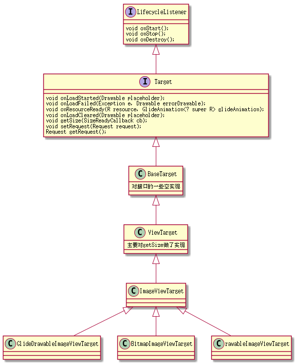
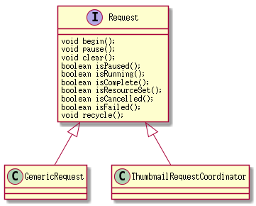

#Glide into()都做了什么

先看看into(ImageView)

GenericRequestBuilder.java
```java
public Target<TranscodeType> into(ImageView view) {
        Util.assertMainThread();
        if (view == null) {
            throw new IllegalArgumentException("You must pass in a non null View");
        }

        if (!isTransformationSet && view.getScaleType() != null) {
            switch (view.getScaleType()) {
                case CENTER_CROP:
                    applyCenterCrop();
                    break;
                case FIT_CENTER:
                case FIT_START:
                case FIT_END:
                    applyFitCenter();
                    break;
                //$CASES-OMITTED$
                default:
                    // Do nothing.
            }
        }

        return into(glide.buildImageViewTarget(view, transcodeClass));
    }

```
先断言是不是主线程，如果没设isTransformationSet就考虑采用ImageView的ScaleType,不过Glide也就只有两种方式:applyCenterCrop,applyFitCenter
而它的具体实现体现在子类:来看看DrawableRequestBuilder.java
```java

  public DrawableRequestBuilder<ModelType> centerCrop() {
        return transform(glide.getDrawableCenterCrop());
    }

      public DrawableRequestBuilder<ModelType> fitCenter() {
            return transform(glide.getDrawableFitCenter());
        }

```

最终会调用GenericRequestBuilder.transform，前面我们讲过一点transform　api,这里我们再深入讲解

applyCenterCrop－>调用到transform而transform用到的是Glide的CenterCrop:

Glide.java初始化的时候会初始化bitmapFitCenter

```java

bitmapFitCenter = new FitCenter(bitmapPool);
 drawableCenterCrop = new GifBitmapWrapperTransformation(bitmapPool, bitmapCenterCrop);

```

GifBitmapWrapperTransformation是处理两种图片资源的包装类

```java

 GifBitmapWrapperTransformation(Transformation<Bitmap> bitmapTransformation,
            Transformation<GifDrawable> gifDataTransformation) {
        this.bitmapTransformation = bitmapTransformation;
        this.gifDataTransformation = gifDataTransformation;
    }

    @Override
     public Resource<GifBitmapWrapper> transform(Resource<GifBitmapWrapper> resource, int outWidth, int outHeight) {
         Resource<Bitmap> bitmapResource = resource.get().getBitmapResource();
         Resource<GifDrawable> gifResource = resource.get().getGifResource();
         if (bitmapResource != null && bitmapTransformation != null) {
             Resource<Bitmap> transformed = bitmapTransformation.transform(bitmapResource, outWidth, outHeight);
             if (!bitmapResource.equals(transformed)) {
                 GifBitmapWrapper gifBitmap = new GifBitmapWrapper(transformed, resource.get().getGifResource());
                 return new GifBitmapWrapperResource(gifBitmap);
             }
         } else if (gifResource != null && gifDataTransformation != null) {
             Resource<GifDrawable> transformed = gifDataTransformation.transform(gifResource, outWidth, outHeight);
             if (!gifResource.equals(transformed)) {
                 GifBitmapWrapper gifBitmap = new GifBitmapWrapper(resource.get().getBitmapResource(), transformed);
                 return new GifBitmapWrapperResource(gifBitmap);
             }
         }
         return resource;
     }


```
我们重点关注bitmapTransformation的实现也就是FitCenter实现

FitCenter.java
```java

public class FitCenter extends BitmapTransformation {

    public FitCenter(Context context) {
        super(context);
    }

    public FitCenter(BitmapPool bitmapPool) {
        super(bitmapPool);
    }

    @Override
    protected Bitmap transform(BitmapPool pool, Bitmap toTransform, int outWidth, int outHeight) {
        return TransformationUtils.fitCenter(toTransform, pool, outWidth, outHeight);
    }

    @Override
    public String getId() {
        return "FitCenter.com.bumptech.glide.load.resource.bitmap";
    }
}
```

再看看TransformationUtils.java

```java

 public static Bitmap fitCenter(Bitmap toFit, BitmapPool pool, int width, int height) {
        if (toFit.getWidth() == width && toFit.getHeight() == height) {
            if (Log.isLoggable(TAG, Log.VERBOSE)) {
                Log.v(TAG, "requested target size matches input, returning input");
            }
            return toFit;
        }
        final float widthPercentage = width / (float) toFit.getWidth();
        final float heightPercentage = height / (float) toFit.getHeight();
        final float minPercentage = Math.min(widthPercentage, heightPercentage);

        // take the floor of the target width/height, not round. If the matrix
        // passed into drawBitmap rounds differently, we want to slightly
        // overdraw, not underdraw, to avoid artifacts from bitmap reuse.
        final int targetWidth = (int) (minPercentage * toFit.getWidth());
        final int targetHeight = (int) (minPercentage * toFit.getHeight());

        if (toFit.getWidth() == targetWidth && toFit.getHeight() == targetHeight) {
            if (Log.isLoggable(TAG, Log.VERBOSE)) {
                Log.v(TAG, "adjusted target size matches input, returning input");
            }
            return toFit;
        }

        Bitmap.Config config = getSafeConfig(toFit);
        Bitmap toReuse = pool.get(targetWidth, targetHeight, config);
        if (toReuse == null) {
            toReuse = Bitmap.createBitmap(targetWidth, targetHeight, config);
        }
        // We don't add or remove alpha, so keep the alpha setting of the Bitmap we were given.
        TransformationUtils.setAlpha(toFit, toReuse);

        if (Log.isLoggable(TAG, Log.VERBOSE)) {
            Log.v(TAG, "request: " + width + "x" + height);
            Log.v(TAG, "toFit:   " + toFit.getWidth() + "x" + toFit.getHeight());
            Log.v(TAG, "toReuse: " + toReuse.getWidth() + "x" + toReuse.getHeight());
            Log.v(TAG, "minPct:   " + minPercentage);
        }

        Canvas canvas = new Canvas(toReuse);
        Matrix matrix = new Matrix();
        matrix.setScale(minPercentage, minPercentage);
        Paint paint = new Paint(PAINT_FLAGS);
        canvas.drawBitmap(toFit, matrix, paint);

        return toReuse;
    }
```
先去算出targetWidth,和targetHeight,其原理就是，看宽高比谁大，展示bitmap的宽比高多的多，就以高适配宽，反之以宽适配高
然后是通过bitmapPool去找到有没有这个targetWidth,targetHeight的缓存，有就拿出来复用,没有就创建新的。

BitmapPool初始化源码：

Glide.java
```java

 if (bitmapPool == null) {
            if (Build.VERSION.SDK_INT >= Build.VERSION_CODES.HONEYCOMB) {
                int size = calculator.getBitmapPoolSize();
                bitmapPool = new LruBitmapPool(size);
            } else {
                bitmapPool = new BitmapPoolAdapter();
            }
        }
```

> LruBitmapPool的源码后面的章节再讲.

继续关注into
```java

into(glide.buildImageViewTarget(view, transcodeClass))
```
通过glide创建了一个target，且把transcodeClass传进去了


再看Glide.java实现buildImageViewTarget

```java
 <R> Target<R> buildImageViewTarget(ImageView imageView, Class<R> transcodedClass) {
        return imageViewTargetFactory.buildTarget(imageView, transcodedClass);
    }


    public class ImageViewTargetFactory {

        @SuppressWarnings("unchecked")
        public <Z> Target<Z> buildTarget(ImageView view, Class<Z> clazz) {
            if (GlideDrawable.class.isAssignableFrom(clazz)) {
                return (Target<Z>) new GlideDrawableImageViewTarget(view);
            } else if (Bitmap.class.equals(clazz)) {
                return (Target<Z>) new BitmapImageViewTarget(view);
            } else if (Drawable.class.isAssignableFrom(clazz)) {
                return (Target<Z>) new DrawableImageViewTarget(view);
            } else {
                throw new IllegalArgumentException("Unhandled class: " + clazz
                        + ", try .as*(Class).transcode(ResourceTranscoder)");
            }
        }
    }


```

有三种ImageViewTarget,生成target之后

```java
 public <Y extends Target<TranscodeType>> Y into(Y target) {
        Util.assertMainThread();
        if (target == null) {
            throw new IllegalArgumentException("You must pass in a non null Target");
        }
        if (!isModelSet) {
            throw new IllegalArgumentException("You must first set a model (try #load())");
        }

        Request previous = target.getRequest();

        if (previous != null) {
            previous.clear();
            requestTracker.removeRequest(previous);
            previous.recycle();
        }

        Request request = buildRequest(target);
        target.setRequest(request);
        lifecycle.addListener(target);
        requestTracker.runRequest(request);

        return target;
    }

```
它会把request和target进行绑定如果target之前有request就解绑，并回收它,然后创建新的request
这里的创建非常有意思，它是通过一个池子来获取，recycle的时候会把所有属性都赋值为空，并回收到池子中。

注意lifecycle.addListener(target);这里的lifecycle如果是Activity的话，它就是ActivityFragmentLifecycle，我们知道activity会把它的生命周期传递给ActivityFragmentLifecycle，然后ActivityFragmentLifecycle会分发给target

target如同一个请求落地页，请求之后，通过target去处理请求结果

target家族(部分):



简单说一下ViewTarget怎么通过SizeDeterminer处理getSize的:
当ViewTarget的getSize被调用的时候会调用SizeDeterminer的getSize,如果此时没拿到(通过layoutParm拿失败了，或没走onMeasure)</br>
它会通过一个list记录回调,当走到preDraw的时候会通知所有回调者它测量成功了

```java
   public void getSize(SizeReadyCallback cb) {
            int currentWidth = getViewWidthOrParam();
            int currentHeight = getViewHeightOrParam();
            if (isSizeValid(currentWidth) && isSizeValid(currentHeight)) {
                cb.onSizeReady(currentWidth, currentHeight);
            } else {
                // We want to notify callbacks in the order they were added and we only expect one or two callbacks to
                // be added a time, so a List is a reasonable choice.
                if (!cbs.contains(cb)) {
                    cbs.add(cb);
                }
                if (layoutListener == null) {
                    final ViewTreeObserver observer = view.getViewTreeObserver();
                    layoutListener = new SizeDeterminerLayoutListener(this);
                    observer.addOnPreDrawListener(layoutListener);
                }
            }
        }
```

SizeDeterminerLayoutListener是用来监听preDraw的。WeakReference通过弱引用的方式避免内存不被释放的风险。

```java

    private static class SizeDeterminerLayoutListener implements ViewTreeObserver.OnPreDrawListener {
            private final WeakReference<SizeDeterminer> sizeDeterminerRef;

            public SizeDeterminerLayoutListener(SizeDeterminer sizeDeterminer) {
                sizeDeterminerRef = new WeakReference<SizeDeterminer>(sizeDeterminer);
            }

            @Override
            public boolean onPreDraw() {
                if (Log.isLoggable(TAG, Log.VERBOSE)) {
                    Log.v(TAG, "OnGlobalLayoutListener called listener=" + this);
                }
                SizeDeterminer sizeDeterminer = sizeDeterminerRef.get();
                if (sizeDeterminer != null) {
                    sizeDeterminer.checkCurrentDimens();
                }
                return true;
            }
        }

```

当然要记得removeListener

```java
      private void checkCurrentDimens() {
            if (cbs.isEmpty()) {
                return;
            }

            int currentWidth = getViewWidthOrParam();
            int currentHeight = getViewHeightOrParam();
            if (!isSizeValid(currentWidth) || !isSizeValid(currentHeight)) {
                return;
            }

            notifyCbs(currentWidth, currentHeight);
            // Keep a reference to the layout listener and remove it here
            // rather than having the observer remove itself because the observer
            // we add the listener to will be almost immediately merged into
            // another observer and will therefore never be alive. If we instead
            // keep a reference to the listener and remove it here, we get the
            // current view tree observer and should succeed.
            ViewTreeObserver observer = view.getViewTreeObserver();
            if (observer.isAlive()) {
                observer.removeOnPreDrawListener(layoutListener);
            }
            layoutListener = null;
        }

```


Request的创建通过一个队列ArrayDeque进行管理

```java
    public static <A, T, Z, R> GenericRequest<A, T, Z, R> obtain(

    //...
          GenericRequest<A, T, Z, R> request = (GenericRequest<A, T, Z, R>) REQUEST_POOL.poll();
          if (request == null) {
              request = new GenericRequest<A, T, Z, R>();
          }
        //...
      }

    @Override
      public void recycle() {
         //...
          REQUEST_POOL.offer(this);
      }

```

request的api



RequestTracker.runRequest会调到request.begin()
```java

 /**
     * {@inheritDoc}
     */
    @Override
    public void begin() {
        startTime = LogTime.getLogTime();
        if (model == null) {
            onException(null);
            return;
        }

        status = Status.WAITING_FOR_SIZE;
        if (Util.isValidDimensions(overrideWidth, overrideHeight)) {
            onSizeReady(overrideWidth, overrideHeight);
        } else {
            target.getSize(this);
        }

        if (!isComplete() && !isFailed() && canNotifyStatusChanged()) {
            target.onLoadStarted(getPlaceholderDrawable());
        }
        if (Log.isLoggable(TAG, Log.VERBOSE)) {
            logV("finished run method in " + LogTime.getElapsedMillis(startTime));
        }
    }

```
如果界面没有measure，走的是getSize,后面布局成功会走onSizeReady，onSizeReady才会真的走加载逻辑，然后如果图片没加载成功，就通知target用Placeholder

onSizeReady:

如果顺利拿到宽高，就开始走加载逻辑：
```java
 public void onSizeReady(int width, int height) {
        if (Log.isLoggable(TAG, Log.VERBOSE)) {
            logV("Got onSizeReady in " + LogTime.getElapsedMillis(startTime));
        }
        if (status != Status.WAITING_FOR_SIZE) {
            return;
        }
        status = Status.RUNNING;

        width = Math.round(sizeMultiplier * width);
        height = Math.round(sizeMultiplier * height);

        ModelLoader<A, T> modelLoader = loadProvider.getModelLoader();
        final DataFetcher<T> dataFetcher = modelLoader.getResourceFetcher(model, width, height);

        if (dataFetcher == null) {
            onException(new Exception("Failed to load model: \'" + model + "\'"));
            return;
        }
        ResourceTranscoder<Z, R> transcoder = loadProvider.getTranscoder();
        if (Log.isLoggable(TAG, Log.VERBOSE)) {
            logV("finished setup for calling load in " + LogTime.getElapsedMillis(startTime));
        }
        loadedFromMemoryCache = true;
        loadStatus = engine.load(signature, width, height, dataFetcher, loadProvider, transformation, transcoder,
                priority, isMemoryCacheable, diskCacheStrategy, this);
        loadedFromMemoryCache = resource != null;
        if (Log.isLoggable(TAG, Log.VERBOSE)) {
            logV("finished onSizeReady in " + LogTime.getElapsedMillis(startTime));
        }
    }

```

Engine.load开启加载模式

先生成一个key,可以这么说，只要request的所有属性相同，那么它的key一定相同,有兴趣可以看看它们的实现，这里不做过多的解释

```java
  EngineResource<?> cached = loadFromCache(key, isMemoryCacheable);
        if (cached != null) {
            cb.onResourceReady(cached);
            if (Log.isLoggable(TAG, Log.VERBOSE)) {
                logWithTimeAndKey("Loaded resource from cache", startTime, key);
            }
            return null;
        }

```
先从内存缓存里找，如果内存缓存里有，就直接回调给target.

```java

 EngineResource<?> active = loadFromActiveResources(key, isMemoryCacheable);
        if (active != null) {
            cb.onResourceReady(active);
            if (Log.isLoggable(TAG, Log.VERBOSE)) {
                logWithTimeAndKey("Loaded resource from active resources", startTime, key);
            }
            return null;
        }
```

然后从活跃缓存里找，如果找到也直接回调给target

> cache内存缓存的内容在其它章节里讲,本章重点讲它没有缓存的情况

然后看看有没有重复的job，如果有重复的job，直接把回调加给EngineJob,这样，当这个job结束的时候会告诉所有回调者

```java
public <T, Z, R> LoadStatus load(Key signature, int width, int height, DataFetcher<T> fetcher,
            DataLoadProvider<T, Z> loadProvider, Transformation<Z> transformation, ResourceTranscoder<Z, R> transcoder,
            Priority priority, boolean isMemoryCacheable, DiskCacheStrategy diskCacheStrategy, ResourceCallback cb) {
      //...缓存略过

        EngineJob current = jobs.get(key);
        if (current != null) {
            current.addCallback(cb);
            if (Log.isLoggable(TAG, Log.VERBOSE)) {
                logWithTimeAndKey("Added to existing load", startTime, key);
            }
            return new LoadStatus(cb, current);
        }

     //... 真正取图片略过
    }

```
如果任务里有这个Job那就返回一个LoadStatus,LoadStatus只是callback和job的结合体，并还有解绑的功能

```java
    /**
     * Allows a request to indicate it no longer is interested in a given load.
     */
    public static class LoadStatus {
        private final EngineJob engineJob;
        private final ResourceCallback cb;

        public LoadStatus(ResourceCallback cb, EngineJob engineJob) {
            this.cb = cb;
            this.engineJob = engineJob;
        }

        public void cancel() {
            engineJob.removeCallback(cb);
        }
    }


```

如果没有找到重复的job就会build新的job,通过factory创建，此factory拥有两个线程池，它是从Glide初始化的时候得来的


```java
    static class EngineJobFactory {
        private final ExecutorService diskCacheService;
        private final ExecutorService sourceService;
        private final EngineJobListener listener;

        public EngineJobFactory(ExecutorService diskCacheService, ExecutorService sourceService,
                EngineJobListener listener) {
            this.diskCacheService = diskCacheService;
            this.sourceService = sourceService;
            this.listener = listener;
        }

        public EngineJob build(Key key, boolean isMemoryCacheable) {
            return new EngineJob(key, diskCacheService, sourceService, isMemoryCacheable, listener);
        }
    }

```

Glide.java
```java
 if (sourceService == null) {
            final int cores = Math.max(1, Runtime.getRuntime().availableProcessors());
            sourceService = new FifoPriorityThreadPoolExecutor(cores);
        }
        if (diskCacheService == null) {
            diskCacheService = new FifoPriorityThreadPoolExecutor(1);
        }

```

然后是初始化了decodeJob及runnable.decodeJob集成了decode,encode一系列的工作代码，坐等run

```java
 EngineJob engineJob = engineJobFactory.build(key, isMemoryCacheable);
        DecodeJob<T, Z, R> decodeJob = new DecodeJob<T, Z, R>(key, width, height, fetcher, loadProvider, transformation,
                transcoder, diskCacheProvider, diskCacheStrategy, priority);
        EngineRunnable runnable = new EngineRunnable(engineJob, decodeJob, priority);
        jobs.put(key, engineJob);
        engineJob.addCallback(cb);
        engineJob.start(runnable);

        if (Log.isLoggable(TAG, Log.VERBOSE)) {
            logWithTimeAndKey("Started new load", startTime, key);
        }
        return new LoadStatus(cb, engineJob);

```
然后就是engineJob.start(runnable);

EngineJob.java
```java
   public void start(EngineRunnable engineRunnable) {
        this.engineRunnable = engineRunnable;
        future = diskCacheService.submit(engineRunnable);
    }

```

EngineRunnable的run方法

EngineRunnable.java
```java
 @Override
    public void run() {
        if (isCancelled) {
            return;
        }

        Exception exception = null;
        Resource<?> resource = null;
        try {
            resource = decode();
        } catch (Exception e) {
            if (Log.isLoggable(TAG, Log.VERBOSE)) {
                Log.v(TAG, "Exception decoding", e);
            }
            exception = e;
        }

        if (isCancelled) {
            if (resource != null) {
                resource.recycle();
            }
            return;
        }

        if (resource == null) {
            onLoadFailed(exception);
        } else {
            onLoadComplete(resource);
        }
    }

```


## 首先分清几个概念getEncoder,getSourceEncoder,getCacheDecoder,getSourceDecoder

writeTransformedToCache-getEncoder:transformed后的图片保存本地

cacheAndDecodeSourceData-getSourceEncoder：直接把网络流保存成本地流

loadFromCache-getCacheDecoder：本地流转成Bitmap，不管是原图还是形变后的图

decodeFromSourceData-getSourceDecoder:当缓存策略为不缓存的时候，直接把网络流转成图片 :flushed:

可以通过一个DataLoadProvider的构造猜出来：（当然后面会拿出证据）
```java
   public StreamBitmapDataLoadProvider(BitmapPool bitmapPool, DecodeFormat decodeFormat) {
        sourceEncoder = new StreamEncoder();//输入流保存成文件
        sourceDecoder = new StreamBitmapDecoder(bitmapPool, decodeFormat);//输入流转成bitmap
        encoder = new BitmapEncoder();//把bitmap保存成文件
        cacheDecoder = new FileToStreamDecoder<Bitmap>(decoder);//File转成bitmap
    }

```

EngineRunnable有两个过程：Stage.CACHE,Stage.SOURCE

当EngineRunnable初始化的时候Stage=CACHE

```java
  public EngineRunnable(EngineRunnableManager manager, DecodeJob<?, ?, ?> decodeJob, Priority priority) {
  //..
        this.stage = Stage.CACHE;
  //..
    }


```
那第一次run的时候是在diskCacheService的线程池里进行，接着走decode分两种情况，如果stage=cache就走缓存

```java
   private Resource<?> decode() throws Exception {
        if (isDecodingFromCache()) {
            return decodeFromCache();
        } else {
            return decodeFromSource();
        }
    }
```

先decode Transform后的图片，没有再考虑用原图

```java
    private Resource<?> decodeFromCache() throws Exception {
        Resource<?> result = null;
        try {
            result = decodeJob.decodeResultFromCache();
        } catch (Exception e) {
            if (Log.isLoggable(TAG, Log.DEBUG)) {
                Log.d(TAG, "Exception decoding result from cache: " + e);
            }
        }

        if (result == null) {
            result = decodeJob.decodeSourceFromCache();
        }
        return result;
    }

```

优先走transform 后的图上也就是resultFromCache
```java
  public Resource<Z> decodeResultFromCache() throws Exception {
        if (!diskCacheStrategy.cacheResult()) {//如果不缓存transformed就直接返回null了
            return null;
        }

        //..
        Resource<T> transformed = loadFromCache(resultKey);
       //..
        Resource<Z> result = transcode(transformed);//此处做了transcode，把GifBitmapWrapper转成GlideBitmapDrawable
       //..
        return result;
    }

```

如果没有就走原图
```java
 public Resource<Z> decodeSourceFromCache() throws Exception {
        if (!diskCacheStrategy.cacheSource()) {
            return null;
        }

       //..
        Resource<T> decoded = loadFromCache(resultKey.getOriginalKey());
        //..
        return transformEncodeAndTranscode(decoded);
    }


```
用原图和用transform之后的图，区别仅仅是原图的话再做一次transform

loadFromCache则是把file转成Resource

> 注：loadFromCache用的是cacheDecoder

```java
private Resource<T> loadFromCache(Key key) throws IOException {
        File cacheFile = diskCacheProvider.getDiskCache().get(key);
        if (cacheFile == null) {
            return null;
        }

        Resource<T> result = null;
        try {
            result = loadProvider.getCacheDecoder().decode(cacheFile, width, height);
        } finally {
            if (result == null) {
                diskCacheProvider.getDiskCache().delete(key);
            }
        }
        return result;
    }

```

如果读取缓存失败，则会走onLoadFailed,然后把stage变成Source，再通过Source线程池去重新走一次EngineRunnable

```java
private void onLoadFailed(Exception e) {
        if (isDecodingFromCache()) {
            stage = Stage.SOURCE;
            manager.submitForSource(this);
        } else {
            manager.onException(e);
        }
}

```

重新run就是走decodeFromSource

```java
 public Resource<Z> decodeFromSource() throws Exception {
        Resource<T> decoded = decodeSource();
        return transformEncodeAndTranscode(decoded);
    }


```


decodeSource里fetcher登场，它就是真正去取数据的工具，取完之后走decodeFromSourceData
```java
    private Resource<T> decodeSource() throws Exception {
        Resource<T> decoded = null;
        try {
           //..
            final A data = fetcher.loadData(priority);
            //..
            decoded = decodeFromSourceData(data);
        } finally {
            fetcher.cleanup();
        }
        return decoded;
    }

```

decodeFromSourceData方法里先看要不要保存源文件：

如果要保存走保存流程，保存完后再从缓存里读出来给target

如果不要保存，就直接通过SourceDecoder去解析
```java
  private Resource<T> decodeFromSourceData(A data) throws IOException {
        final Resource<T> decoded;
        if (diskCacheStrategy.cacheSource()) {
            decoded = cacheAndDecodeSourceData(data);
        } else {
        //..
            decoded = loadProvider.getSourceDecoder().decode(data, width, height);
        //..
        }
        return decoded;
    }

```

先通过getSourceEncoder保存本地，再通过loadFromCache(getCacheDecoder)把缓存里的读出来
```java
   private Resource<T> cacheAndDecodeSourceData(A data) throws IOException {
        SourceWriter<A> writer = new SourceWriter<A>(loadProvider.getSourceEncoder(), data);
        diskCacheProvider.getDiskCache().put(resultKey.getOriginalKey(), writer);
        Resource<T> result = loadFromCache(resultKey.getOriginalKey());
        return result;
    }

```

最后原图decode成功会走transform也就transformEncodeAndTranscode方法

```java
 private Resource<Z> transformEncodeAndTranscode(Resource<T> decoded) {
        Resource<T> transformed = transform(decoded);
        writeTransformedToCache(transformed);
        Resource<Z> result = transcode(transformed);
        return result;
    }

```

把转换后的图存本地的时候用到了getEncoder
```java
    private void writeTransformedToCache(Resource<T> transformed) {
        if (transformed == null || !diskCacheStrategy.cacheResult()) {
            return;
        }
        SourceWriter<Resource<T>> writer = new SourceWriter<Resource<T>>(loadProvider.getEncoder(), transformed);
        diskCacheProvider.getDiskCache().put(resultKey, writer);
    }

```

into的流程大致就是这样，先走内存缓存内存没有，再走sd卡缓存，如果sd卡缓存没有，再走网络(也有可能是别的途径)。