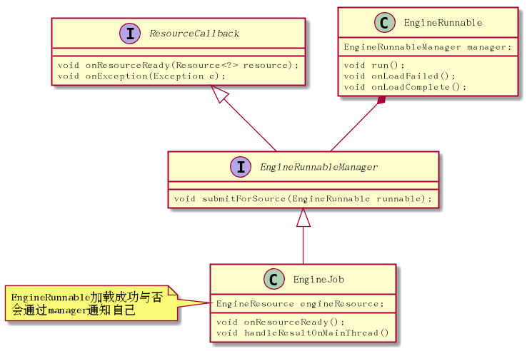
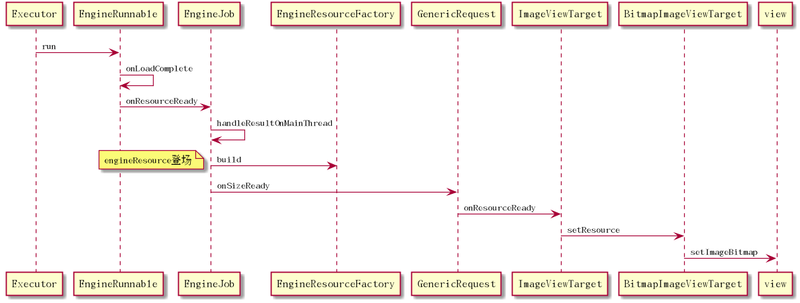

# Glide 请求结果之Resource处理

前面我们提到EngineRunnable如何得到一个Resource，下面我们来看这个Resource怎么传递的

类图


实序图:


EngineRunnable.java
```java
@Override
    public void run() {
      //...
        if (resource == null) {
            onLoadFailed(exception);
        } else {
            onLoadComplete(resource);
        }
    }

```

如果成功走onLoadComplete,再走EngineJob.onResourceReady

```java
  private void onLoadComplete(Resource resource) {
        manager.onResourceReady(resource);
    }

```

再走主线程的handler发消息
```java
 @Override
    public void onResourceReady(final Resource<?> resource) {
        this.resource = resource;
        MAIN_THREAD_HANDLER.obtainMessage(MSG_COMPLETE, this).sendToTarget();
    }

```
再走handleResultOnMainThread

```java
 @Override
        public boolean handleMessage(Message message) {
            if (MSG_COMPLETE == message.what || MSG_EXCEPTION == message.what) {
                EngineJob job = (EngineJob) message.obj;
                if (MSG_COMPLETE == message.what) {
                    job.handleResultOnMainThread();
                } else {
                    job.handleExceptionOnMainThread();
                }
                return true;
            }

            return false;
        }

```

然后是包装了一个EngineResource,先acquire()然后release,中间会把所有的callback遍历一下，如果有一个callback，它的acquire+1
```java
 private void handleResultOnMainThread() {
        if (isCancelled) {
            resource.recycle();
            return;
        } else if (cbs.isEmpty()) {
            throw new IllegalStateException("Received a resource without any callbacks to notify");
        }
        engineResource = engineResourceFactory.build(resource, isCacheable);
        hasResource = true;

        // Hold on to resource for duration of request so we don't recycle it in the middle of notifying if it
        // synchronously released by one of the callbacks.
        engineResource.acquire();
        listener.onEngineJobComplete(key, engineResource);

        for (ResourceCallback cb : cbs) {
            if (!isInIgnoredCallbacks(cb)) {
                engineResource.acquire();
                cb.onResourceReady(engineResource);
            }
        }
        // Our request is complete, so we can release the resource.
        engineResource.release();
    }

```


这里的acquire是为了内存缓存，后面会讲解

这里的cb至少有一个，那就是GenericRequest
GenericRequest.onSizeReady里最后一个参数就是callback
```java
  loadStatus = engine.load(signature, width, height, dataFetcher, loadProvider, transformation, transcoder,
                priority, isMemoryCacheable, diskCacheStrategy, this);//this就是callback

```

所以会回调给Request

```java
 private void onResourceReady(Resource<?> resource, R result) {
        // We must call isFirstReadyResource before setting status.
        boolean isFirstResource = isFirstReadyResource();
        status = Status.COMPLETE;
        this.resource = resource;

        if (requestListener == null || !requestListener.onResourceReady(result, model, target, loadedFromMemoryCache,
                isFirstResource)) {
            GlideAnimation<R> animation = animationFactory.build(loadedFromMemoryCache, isFirstResource);
            target.onResourceReady(result, animation);
        }

        notifyLoadSuccess();

       //..
    }

```

然后是走 target.onResourceReady(result, animation);

ImageViewTarget.java
```java
  @Override
    public void onResourceReady(Z resource, GlideAnimation<? super Z> glideAnimation) {
        if (glideAnimation == null || !glideAnimation.animate(resource, this)) {
            setResource(resource);
        }
    }

```

DrawableImageViewTarget.java
```java
public class DrawableImageViewTarget extends ImageViewTarget<Drawable> {
    public DrawableImageViewTarget(ImageView view) {
        super(view);
    }

    @Override
    protected void setResource(Drawable resource) {
       view.setImageDrawable(resource);
    }
}


```

