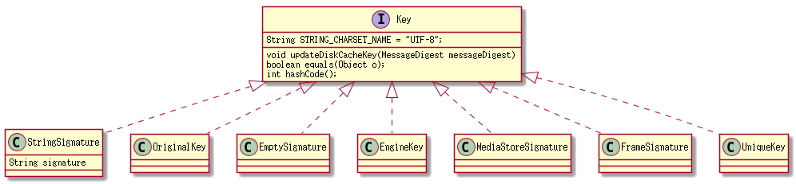

# Glide 之Signature

每一个请求，都有一个唯一标识，内存缓存和持久化通过这个唯一标识来区分该请求是否命中使用缓存数据。<br/>
所以Glide通过Signature来实现这个唯一标识，也就是接口Key.
以下是Key的家谱



内存缓存用到的是EngineKey,在Engine.load的时候，它会重新创建一个EngineKey

```java
public <T, Z, R> LoadStatus load( //...ignore code

//...ignore code
  EngineKey key = keyFactory.buildKey(id, signature, width, height,//...ignore code
                //...ignore code

   EngineResource<?> cached = loadFromCache(key, isMemoryCacheable);
   //...ignore code
   EngineResource<?> active = loadFromActiveResources(key, isMemoryCacheable);
     //...ignore code
   EngineJob current = jobs.get(key);
```

## 为什么它不用原有的signature而要重新包装一个EngineKey

原因是：通过EngineKey我们能知道这个请求的详细细节，从而判断要不要用对应的缓存。目的是用在内存缓存上

如：width,height,cacheDecoder,decoder,transformation等；
Glide对缓存做了精准投放，哪怕是同一张图，request所要的宽度不一样，它都不会命中。

```java
class EngineKey implements Key {
    private static final String EMPTY_LOG_STRING = "";
    private final String id;
    private final int width;
    private final int height;
    private final ResourceDecoder cacheDecoder;
    private final ResourceDecoder decoder;
    private final Transformation transformation;
    private final ResourceEncoder encoder;
    private final ResourceTranscoder transcoder;
    private final Encoder sourceEncoder;
    private final Key signature;
    private String stringKey;
    private int hashCode;
    private Key originalKey;

    //...ignore code

@Override
public int hashCode() {
    if (hashCode == 0) {
        hashCode = id.hashCode();
        hashCode = 31 * hashCode + signature.hashCode();
        hashCode = 31 * hashCode + width;
        hashCode = 31 * hashCode + height;
        hashCode = 31 * hashCode + (cacheDecoder   != null ? cacheDecoder  .getId().hashCode() : 0);
        hashCode = 31 * hashCode + (decoder        != null ? decoder       .getId().hashCode() : 0);
        hashCode = 31 * hashCode + (transformation != null ? transformation.getId().hashCode() : 0);
        hashCode = 31 * hashCode + (encoder        != null ? encoder       .getId().hashCode() : 0);
        hashCode = 31 * hashCode + (transcoder     != null ? transcoder    .getId().hashCode() : 0);
        hashCode = 31 * hashCode + (sourceEncoder  != null ? sourceEncoder .getId().hashCode() : 0);
    }
    return hashCode;
}

```

## 持久化的时候，transform后会缓存下来，而这个缓存也需要记录它的特性

看看写transformed的缓存，用的是resultKey
```java
private void writeTransformedToCache(Resource<T> transformed) {
    if (transformed == null || !diskCacheStrategy.cacheResult()) {
        return;
    }
    long startTime = LogTime.getLogTime();
    SourceWriter<Resource<T>> writer = new SourceWriter //...ignore code
    diskCacheProvider.getDiskCache().put(resultKey, writer);//这里的resultKey 就是EngineKey
   //...ignore code
}

```

而写原图的时候用的是originalKey

```java
 private Resource<T> cacheAndDecodeSourceData(A data) {
        long startTime = LogTime.getLogTime();
        SourceWriter<A> writer = new SourceWriter<A>(loadProvider.getSourceEncoder(), data);
        diskCacheProvider.getDiskCache().put(resultKey.getOriginalKey(), writer);
       //...ignore code

        startTime = LogTime.getLogTime();
        Resource<T> result = loadFromCache(resultKey.getOriginalKey());//用的是原始key
      //...ignore code
        return result;
    }

```

再看看EngineKey在写文件的时候，它是通过safeKey获取文件目录

DiskLruCacheWrapper.java:
```java
 @Override
    public File get(Key key) {
        String safeKey = safeKeyGenerator.getSafeKey(key);
        File result = null;
        try {
            final DiskLruCache.Value value = getDiskCache().get(safeKey);
            if (value != null) {
                result = value.getFile(0);
            }
        } catch (IOException e) {
        //...ignore code
        }
        return result;
    }

```

来看看safeKey的源码:

先通过loadIdToSafeHash(LruCache)来做内存缓存，如果缓存没有，就通过SHA-256的方式求出一个Hex值当做key，有点像是md5的做法
```java

public String getSafeKey(Key key) {
        String safeKey;
        synchronized (loadIdToSafeHash) {
            safeKey = loadIdToSafeHash.get(key);
        }
        if (safeKey == null) {
            try {
                MessageDigest messageDigest = MessageDigest.getInstance("SHA-256");
                key.updateDiskCacheKey(messageDigest);
                safeKey = Util.sha256BytesToHex(messageDigest.digest());
            } catch (UnsupportedEncodingException e) {
                e.printStackTrace();
            } catch (NoSuchAlgorithmException e) {
                e.printStackTrace();
            }
            synchronized (loadIdToSafeHash) {
                loadIdToSafeHash.put(key, safeKey);
            }
        }
        return safeKey;
    }

```

## Glide请求的原始Key

前面说到Glide走到缓存层的时候，会对key进行加工，那发请求的时候，这个key是很单一的

### fromResource是通过versionCode来当key值
```java
  public DrawableTypeRequest<Integer> fromResource() {
        return (DrawableTypeRequest<Integer>) loadGeneric(Integer.class)
                .signature(ApplicationVersionSignature.obtain(context));
    }

```

ApplicationVersionSignature.java
```java
  private static Key obtainVersionSignature(Context context) {
        PackageInfo pInfo = null;
        try {
            pInfo = context.getPackageManager().
            getPackageInfo(context.getPackageName(), 0);
        } catch (PackageManager.NameNotFoundException e) {
            // Should never happen.
            e.printStackTrace();
        }
        final String versionCode;
        if (pInfo != null) {
            versionCode = String.valueOf(pInfo.versionCode);//用的是versionCode
        } else {
            versionCode = UUID.randomUUID().toString();
        }
        return new StringSignature(versionCode);
    }

```

### fromString 用的是默认EmptySignature
那它是通过什么标识url?是通过id

```java
class OriginalKey implements Key {

    private final String id;
    private final Key signature;

    public OriginalKey(String id, Key signature) {
        this.id = id;
        this.signature = signature;
    }

```

### fromFile，也是通过id
而这个id就是通过LocalUriFetcher得到的id

Engine.java load方法:
```java
 final String id = fetcher.getId();
 EngineKey key = keyFactory.buildKey(id, signature, width, height,
                loadProvider.getCacheDecoder(),
                loadProvider.getSourceDecoder(), transformation,
                loadProvider.getEncoder(),
                transcoder, loadProvider.getSourceEncoder());
```
LocalUriFecher是通过StreamUriLoader创建
在创建requestBuilder的时候，会先构建ModelLoader
```java

  ModelLoader<T, InputStream> streamModelLoader =
   Glide.buildStreamModelLoader(modelClass, context);

```

而ModeLoader的factory在Glide初始化的时候就已经注册好了
```java
 register(File.class, InputStream.class, new StreamFileLoader.Factory());

```

### fromByte
因为byte数组就相当是内存缓存，所以glide不需要为它提供缓存策略，因为它的signature是一个randomUUID，且走任何缓存

```java
  public DrawableTypeRequest<byte[]> fromBytes() {
        return (DrawableTypeRequest<byte[]>) loadGeneric(byte[].class)
                .signature(new StringSignature(UUID.randomUUID().toString()))
                .diskCacheStrategy(DiskCacheStrategy.NONE)
                .skipMemoryCache(true /*skipMemoryCache*/);
    }

```

### fromUri
如果是网络的Uri走的是HttpUrlFetcher的getId，最终还是url地址当作key

