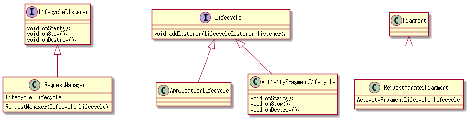
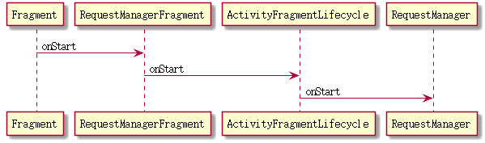

# Glide1
## Glide.width(context)都做了些什么
```java
   public static RequestManager with(Activity activity) {
         RequestManagerRetriever retriever = RequestManagerRetriever.get();
         return retriever.get(activity);
     }
```
Retriever是猎犬的意思,我认为RequestManagerRetriever是享元模式，只要width()里的参数是同一个对象，它拿到的一定是同一个RequestManager。<br/>
而它并不会去把RequestManager存在自己的成员当中,而是用了一个Fragment，存于FragmentManager当中，而此Fragment如果没有RequestManger，则会new一个RequestManager;<br/>
而用Fragment的好处是能不通过用户告知就知道当前界面的生命周期，有点神出鬼没有没有！！

```java

    @TargetApi(Build.VERSION_CODES.JELLY_BEAN_MR1)
    public RequestManager get(android.app.Fragment fragment) {
        if (fragment.getActivity() == null) {
            throw new IllegalArgumentException("You cannot start a load on a fragment before it is attached");
        }
        if (Util.isOnBackgroundThread() || Build.VERSION.SDK_INT < Build.VERSION_CODES.JELLY_BEAN_MR1) {
            return get(fragment.getActivity().getApplicationContext());
        } else {
            android.app.FragmentManager fm = fragment.getChildFragmentManager();
            return fragmentGet(fragment.getActivity(), fm);
        }
    }

    @TargetApi(Build.VERSION_CODES.JELLY_BEAN_MR1)
    RequestManagerFragment getRequestManagerFragment(final android.app.FragmentManager fm) {
        RequestManagerFragment current = (RequestManagerFragment) fm.findFragmentByTag(FRAGMENT_TAG);
        if (current == null) {
            current = pendingRequestManagerFragments.get(fm);
            if (current == null) {
                current = new RequestManagerFragment();
                pendingRequestManagerFragments.put(fm, current);
                fm.beginTransaction().add(current, FRAGMENT_TAG).commitAllowingStateLoss();
                handler.obtainMessage(ID_REMOVE_FRAGMENT_MANAGER, fm).sendToTarget();
            }
        }
        return current;
    }


    @TargetApi(Build.VERSION_CODES.HONEYCOMB)
    RequestManager fragmentGet(Context context, android.app.FragmentManager fm) {
        RequestManagerFragment current = getRequestManagerFragment(fm);
        RequestManager requestManager = current.getRequestManager();
        if (requestManager == null) {
            Log.d("seekting", "RequestManagerRetriever.fragmentGet()重新创建requestManager");
            requestManager = new RequestManager(context, current.getLifecycle(), current.getRequestManagerTreeNode());
            current.setRequestManager(requestManager);
        } else {
            Log.d("seekting", "RequestManagerRetriever.fragmentGet()利用以前的requestManager");
        }
        return requestManager;
    }
```
>有一个小知识点，为什么会有一段这样的代码：

> `handler.obtainMessage(ID_REMOVE_FRAGMENT_MANAGER, fm).sendToTarget();`
> 想想如果在一个Fragment里多次调用Glide.with().因为commitAllowingStateLoss之后，并不能立马findFragmentByTag找到，所以作者需要先把它存起来，等能找到的时候再将它行色移出去.


RequestManagerRetriever拿requestManager,requestManager有很多种:
> 如:Activity,fragment,application,FragmentActivity

## RequestManager如何撑控生命周期



> 注：fragment和fragmentActivity的话，它会创建对应的Fragment提交给FragmentManager，也就是说它丫用了一个Fragment去保存一个requestManager,而这个Fragment又被FragmentManager        持有.这里面还用到了pendingRequestManagerFragments，主要是 fm.beginTransaction().add(current, FRAGMENT_TAG).commitAllowingStateLoss();之后，不会立码被find到.

实现LifecycleListener(onStart(),onStop(),onDesory())接口，

承载RequestManager的fragment首先会创建一个ActivityFragmentLifecycle,<br/>Fragment的生命周期会转交给ActivityFragmentLifecycle，而ActivityFragmentLifecycle会告诉它的listener现在Fragment所处的生命周期，此listener就是RequestManager,最终RequestManager得到了Fragment的生命周期。
这个设计很绕,可以用时序图来表示：




## RequestManagerFragment的成员

```java
    private final ActivityFragmentLifecycle lifecycle;//为了告诉RequestManager它的生命周期
    private final RequestManagerTreeNode requestManagerTreeNode = new FragmentRequestManagerTreeNode();
    private RequestManager requestManager;
    private final HashSet<RequestManagerFragment> childRequestManagerFragments
        = new HashSet<RequestManagerFragment>();
    private RequestManagerFragment rootRequestManagerFragment;
```

先看rootRequestManagerFragment,它是Activity的根节点
```java
 @Override
    public void onAttach(Activity activity) {
        super.onAttach(activity);
        rootRequestManagerFragment = RequestManagerRetriever.get()
                .getSupportRequestManagerFragment(getActivity().getSupportFragmentManager());
        if (rootRequestManagerFragment != this) {
            rootRequestManagerFragment.addChildRequestManagerFragment(this);
        }
    }

    @Override
    public void onDetach() {
        super.onDetach();
        if (rootRequestManagerFragment != null) {
            rootRequestManagerFragment.removeChildRequestManagerFragment(this);
            rootRequestManagerFragment = null;
        }
    }


```

通过getActivity().getSupportFragmentManager()拿Activity级的RequestFragment,然后判断是否相等，如果不相等，显然就是child.
同时onDetach的时候把child remove掉.<br/>
childRequestManagerFragments和rootRequestManagerFragment用来做什么的呢？<br/>
原来是为FragmentRequestManagerTreeNode服务的,而TreeNode最终会被RequestManager的resumeRequestsRecursive()方法所用.
但是此方法Glide内部没有调用，是公开给接入者用的.
```java

    /**
     * Performs {@link #resumeRequests()} recursively for all managers that are contextually descendant
     * to this manager based on the Activity/Fragment hierarchy. The hierarchical semantics are identical as for
     * {@link #pauseRequestsRecursive()}.
     */
    public void resumeRequestsRecursive() {
        Util.assertMainThread();
        resumeRequests();
        for (RequestManager requestManager : treeNode.getDescendants()) {
            requestManager.resumeRequests();
        }
    }

    public void pauseRequestsRecursive() {
            Util.assertMainThread();
            pauseRequests();
            for (RequestManager requestManager : treeNode.getDescendants()) {
                requestManager.pauseRequests();
            }
        }

```

#### RequestManagerFragment有两个设计有点让人觉得曲折:
1.为什么要通过ActivityFragmentLifecycle把生命周期通过ActivityFragmentLifecycle传给RequestManager.而不直接通过自己持有RequestManager然后调用RequestManager的onStart,onStop
>　或许通过这个中间层能突出一个生命周期模块，且好扩展；另外就是GenericRequestBuilder也用到了lifeCycle

2.为什么要通过一个内部类TreeNode来把所有的descendants交给处部?
> 或许这样能让外部更少的知道fragment而通过treeNode访问一个api,也就是最少知道原则

#### getDescendantRequestManagerFragments方法有点问题

```java
  /**
     * Returns the set of fragments that this RequestManagerFragment's parent is a parent to. (i.e. our parent is
     * the fragment that we are annotating).
     */
    public Set<SupportRequestManagerFragment> getDescendantRequestManagerFragments() {
        if (rootRequestManagerFragment == null) {
            return Collections.emptySet();
        } else if (rootRequestManagerFragment == this) {
            return Collections.unmodifiableSet(childRequestManagerFragments);
        } else {
            HashSet<SupportRequestManagerFragment> descendants =
                new HashSet<SupportRequestManagerFragment>();
            for (SupportRequestManagerFragment fragment
                : rootRequestManagerFragment.getDescendantRequestManagerFragments()) {
                if (isDescendant(fragment.getParentFragment())) { //此处为什么要传parent
                    descendants.add(fragment);
                }
            }
            return Collections.unmodifiableSet(descendants);
        }
    }
```


```java

    /**
     * Returns true if the fragment is a descendant of our parent.
     */
    private boolean isDescendant(Fragment fragment) {
        Fragment root = this.getParentFragment();
        while (fragment.getParentFragment() != null) {
            if (fragment.getParentFragment() == root) {
                return true;
            }
            fragment = fragment.getParentFragment();
        }
        return false;
    }
```

>此api明明是想把和自己父亲是同一个祖先的孩子都加到列表里来，但是为什么要加getParent,也就是说任何一个fragment,它的爷爷(或爷爷以上级别)和this的父亲相同，就该加进set;
换句话说，就是任意fragment的爸爸（或爸爸以上）是this，就加进set，这样理解没问题，然而还有一种情况:
A>B>C
C>E>F
C>D>G
如果C用两个子Fragment，如果this是D,fragment是F，F的爷爷是D的爸爸，那F也和D扯上关系，我觉得不合理
另外值得注意的地方是，它返回的是unmodifiableSet，unmodifiableSet是不让再add和remove的

```java

private static class UnmodifiableCollection<E> implements Collection<E>, Serializable {
        private static final long serialVersionUID = 1820017752578914078L;

        final Collection<E> c;

        UnmodifiableCollection(Collection<E> collection) {
            c = collection;
        }

        @Override public boolean add(E object) {
            throw new UnsupportedOperationException();
        }

        @Override public boolean addAll(Collection<? extends E> collection) {
            throw new UnsupportedOperationException();
        }

        @Override public void clear() {
            throw new UnsupportedOperationException();
        }

        @Override public boolean contains(Object object) {
            return c.contains(object);
        }

        @Override public boolean containsAll(Collection<?> collection) {
            return c.containsAll(collection);
        }

        @Override public boolean isEmpty() {
            return c.isEmpty();
        }

        @Override public Iterator<E> iterator() {
            return new Iterator<E>() {
                Iterator<E> iterator = c.iterator();

                @Override public boolean hasNext() {
                    return iterator.hasNext();
                }

                @Override public E next() {
                    return iterator.next();
                }

                @Override public void remove() {
                    throw new UnsupportedOperationException();
                }
            };
        }

        @Override public boolean remove(Object object) {
            throw new UnsupportedOperationException();
        }

        @Override public boolean removeAll(Collection<?> collection) {
            throw new UnsupportedOperationException();
        }

        @Override public boolean retainAll(Collection<?> collection) {
            throw new UnsupportedOperationException();
        }

        @Override public int size() {
            return c.size();
        }

        @Override public Object[] toArray() {
            return c.toArray();
        }

        @Override public <T> T[] toArray(T[] array) {
            return c.toArray(array);
        }

        @Override public String toString() {
            return c.toString();
        }
    }

```

