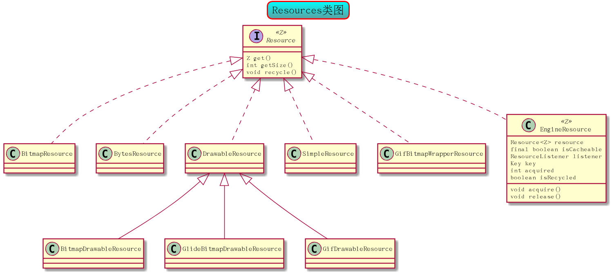

# Glide 巧用EngineResource实现内存缓存

先看看Resource的家族



BitmapResource的实现:
```java
//...
  @Override
    public Bitmap get() {
        return bitmap;
    }

    @Override
    public int getSize() {
        return Util.getBitmapByteSize(bitmap);//bitmap.getAllocationByteCount()
    }

    @Override
    public void recycle() {
        if (!bitmapPool.put(bitmap)) {//用bitmap池回收
            bitmap.recycle();//如果池子装池了，就recycle
        }
    }
```

ByteResource的实现:

```java

//...
    @Override
    public byte[] get() {
        return bytes;
    }

    @Override
    public int getSize() {
        return bytes.length;
    }

    @Override
    public void recycle() {
        // Do nothing.
    }

```

EngineResource.java的实现：
```java
//...
 @Override
    public Z get() {
        return resource.get();//只是调用了原resource的get
    }

    @Override
    public int getSize() {
        return resource.getSize();//只是调用了原resource的api
    }

    @Override
    public void recycle() {
       //..
        isRecycled = true;
        resource.recycle();
    }


    void acquire() {
       //..
        ++acquired;//使用计数
    }


    void release() {
      //..
        if (--acquired == 0) {//释放计数
            listener.onResourceReleased(key, this);//当没有任何地方用它就通知listener回收
        }
    }

```

当调用acquire的时候说明，有地方用它，当用它的地方释放资源的时候，会调用release，当最后一个使用它的地方调用了release就会告诉listener
listener会做什么？

listener其实就是Engine.java

```java
   @Override
    public void onResourceReleased(Key cacheKey, EngineResource resource) {
        activeResources.remove(cacheKey);//《注2》
        if (resource.isCacheable()) {
            cache.put(cacheKey, resource);
        } else {
            resourceRecycler.recycle(resource);
        }
    }

```

如果这个资源是可缓存的，就通过cache内存缓存保存起来，否则recycle掉(BitmapPool回收)
并且activeResources要remove掉它

此处的内存缓存和我们以往见到的不一样，以往我们只是通过一个LRU来持有，而Glide对它做了改进，增加了一层，也就是active层

```java

Map<Key, WeakReference<EngineResource<?>>> activeResources;

```
activeResources是个弱引用

再回顾Engine从内在缓存加载的逻辑

```java
    private EngineResource<?> loadFromCache(Key key, boolean isMemoryCacheable) {
        if (!isMemoryCacheable) {
            return null;
        }

        EngineResource<?> cached = getEngineResourceFromCache(key);
        if (cached != null) {
            cached.acquire();
            activeResources.put(key, new ResourceWeakReference(key, cached, getReferenceQueue()));//《注1》
        }
        return cached;
    }

```

```java
   private EngineResource<?> getEngineResourceFromCache(Key key) {
        Resource<?> cached = cache.remove(key);//直接remove出来

        final EngineResource result;
        if (cached == null) {
            result = null;
        } else if (cached instanceof EngineResource) {
            // Save an object allocation if we've cached an EngineResource (the typical case).
            result = (EngineResource) cached;
        } else {
            result = new EngineResource(cached, true /*isCacheable*/);
        }
        return result;
    }

```
当从cache里拿到resource的时候，cache是直接remove掉，那你一定会问，另一个地方再要这张图怎么办？<br/>
activeResources！通过activeResources，虽然cache remove掉了它，但是它已被系统认定是活跃状态，并放入了activeResources看《注1》<br/>
如果所有用它的地方都release了，也就是acquire记数为0，就会再把它放入cache，同时activeResources去remove　看《注2》

当第一次通过非内存缓存获取到resource，系统也会把它标记成activeResources

```java
   public void onEngineJobComplete(Key key, EngineResource<?> resource) {
        Util.assertMainThread();
        if (resource != null) {
            resource.setResourceListener(key, this);

            if (resource.isCacheable()) {
                activeResources.put(key, new ResourceWeakReference(key, resource, getReferenceQueue()));//
            }
        }
        jobs.remove(key);
    }

```


另外系统还对activeResources做了进一步处理，也就是put的时候是一个WeakReference，当外面没有强引用的时候，会通过Queue去remove


```java
  private static class RefQueueIdleHandler implements MessageQueue.IdleHandler {
        private final Map<Key, WeakReference<EngineResource<?>>> activeResources;
        private final ReferenceQueue<EngineResource<?>> queue;

        public RefQueueIdleHandler(Map<Key, WeakReference<EngineResource<?>>> activeResources,
                ReferenceQueue<EngineResource<?>> queue) {
            this.activeResources = activeResources;
            this.queue = queue;
        }

        @Override
        public boolean queueIdle() {
            ResourceWeakReference ref = (ResourceWeakReference) queue.poll();
            if (ref != null) {
                activeResources.remove(ref.key);
            }

            return true;
        }
    }

```

每次ui线程Idle的时候都会执行queueIdle();如果poll到ref就把它remove

>注：queue没有强引用的时候就能poll到，是一种捕捉弱引用被释放的一个好办法

到此，Resource的内在缓存讲解完毕，确实和我们以往的内在缓存不一样，值得学习！


